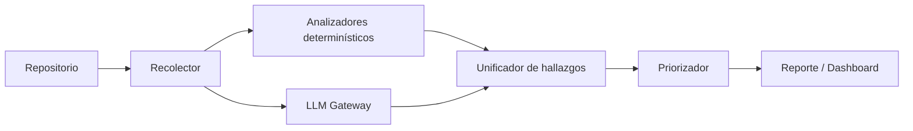
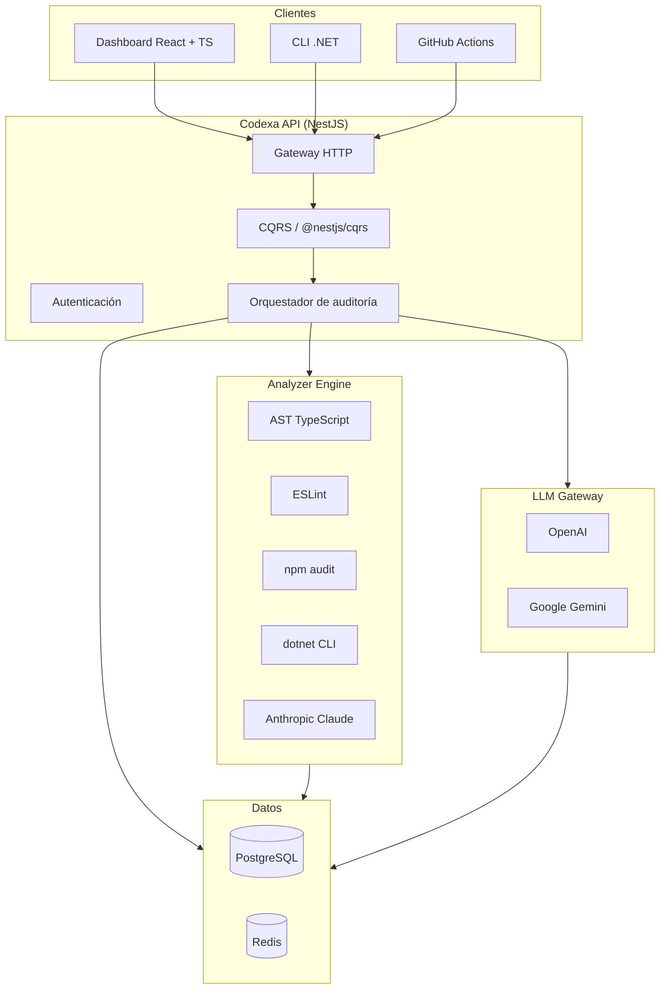

# 00 · Project Overview — Codexa

> **Estado:** Borrador v0.1 · **Última actualización:** 2026-08-05
> **Documentos relacionados:** [01-Roadmap](01-Roadmap.md) · [02-Product-Requirements](02-Product-Requirements.md) · [03-System-Architecture](03-System-Architecture.md) · [04-Technology-Stack](04-Technology-Stack.md) · [05-Coding-Standards](05-Coding-Standards.md)

---

## 1. Resumen ejecutivo

**Codexa** es una plataforma de auditoría de código que combina análisis estático determinístico
con análisis semántico basado en modelos de lenguaje (LLM). Su propósito es responder una sola
pregunta en cualquier repositorio:

> ¿Qué tan sano está este código y qué debería arreglar primero?

Para responderla, Codexa analiza el árbol sintáctico (AST), detecta código muerto, dependencias
vulnerables, funciones sin tests y deuda técnica, y luego usa un LLM para priorizar hallazgos y
generar sugerencias de refactor concretas. Todo se consolida en un **reporte de salud priorizado**
exportable a PDF, Markdown y HTML, disponible también desde un dashboard web y desde GitHub Actions.

El proyecto nace con un doble objetivo: ser un **producto real** de portafolio y una **herramienta
reutilizable** en el día a día del desarrollo de software.

---

## 2. El problema

La deuda técnica es invisible hasta que se convierte en un incidente. Los equipos de software se
enfrentan a problemas recurrentes:

1. **No saben qué arreglar primero.** Hay herramientas de análisis estático (SonarQube, ESLint,
   `tsc`, analyzers del compilador de TypeScript), pero producen cientos de hallazgos sin
   priorización por impacto real en el negocio.
2. **El conocimiento vive en cabezas.** Un dev senior sabe qué partes del código son frágiles,
   pero ese conocimiento no está escrito ni es accionable.
3. **Los reportes de herramientas tradicionales son ruidosos.** No distinguen entre un warning de
   estilo y un riesgo real de seguridad o mantenimiento.
4. **Nadie responde "cómo arreglarlo".** Las herramientas marcan problemas pero rara vez proponen
   refactors concretos con justificación.

Codexa ataca estos cuatro puntos combinando lo determinístico (AST, auditorías de dependencias) con
lo semántico (LLM), y entregando un único artefacto: **un reporte priorizado con sugerencias**.

---

## 3. La solución

Codexa es un pipeline de auditoría en tres etapas:

| Etapa                     | Responsabilidad                                                               |
| ------------------------- | ----------------------------------------------------------------------------- |
| **Recolector**            | Clona/lee el repo, detecta lenguaje y estructura.                             |
| **Analizadores**          | AST de TypeScript (TS/JS), ESLint, `npm audit` (dependencias), detectores de dead code y coverage, y `dotnet` CLI (opcional, para repos .NET). |
| **LLM Gateway**           | Proveedor unificado (OpenAI/Anthropic/Gemini) para priorización y sugerencias. |
| **Unificador + Priorizador** | Consolida hallazgos, deduplica y ordena por impacto × probabilidad.       |
| **Salidas**               | Reportes PDF/Markdown/HTML, dashboard web y comentarios en PRs.               |

---

## 4. Objetivos

### 4.1 Objetivos del producto

- **OP-01** — Auditar cualquier repositorio local o remoto con un solo comando o clic.
- **OP-02** — Producir un *Health Score* (0-100) reproducible y explicable.
- **OP-03** — Priorizar hallazgos por impacto en mantenibilidad, seguridad y rendimiento.
- **OP-04** — Generar sugerencias de refactor accionables con justificación (no solo "esto está mal").
- **OP-05** — Detectar dependencias vulnerables y funciones sin tests.
- **OP-06** — Exportar reportes a PDF, Markdown y HTML.
- **OP-07** — Ejecutar auditorías automáticas en CI vía GitHub Actions.
- **OP-08** — Revisar Pull Requests con comentarios de IA.
- **OP-09** — Comparar la evolución del código entre commits.

### 4.2 Objetivos del proyecto (portafolio)

- **OP-10** — Demostrar dominio de arquitectura real: Clean Architecture, CQRS, integraciones,
  DevOps y calidad.
- **OP-11** — Tener un repositorio con documentación a nivel de producto profesional.
- **OP-12** — Ser un proyecto demostrable con capturas, demo y material para contenido técnico.

---

## 5. No-objetivos (fuera de alcance)

- **No** reemplaza a SonarQube como suite de calidad corporativa (es complementario y agnóstico).
- **No** modifica el código del repositorio auditado (solo analiza y sugiere; el usuario decide).
- **No** ejecuta el código auditado (no corre tests del repo objetivo en su entorno).
- **No** es un analizador de calidad "esotérico": el MVP se enfoca en .NET, TypeScript y JavaScript.
- **No** reentrena modelos (usa LLMs listos para usar vía API; el fine-tuning queda fuera).
- **No** almacena el código fuente completo de repositorios auditados (solo métricas y fragmentos).

---

## 6. Personas

| Persona          | Descripción                                                                 | Necesidad principal                          |
| ---------------- | --------------------------------------------------------------------------- | ------------------------------------------- |
| **Dev individual** | Desarrollador full stack que quiere sanear su propio código.               | Respuesta rápida: "qué arreglo primero".    |
| **Tech Lead**     | Líder técnico que hereda un repositorio o quiere medir deuda.              | Visión global, tendencias y reportes.       |
| **Reviewer**      | Dev que revisa PRs y quiere un segundo par de ojos automático.             | Comentarios contextuales en el diff.        |
| **Hiring/Portafolio** | Reclutador o dev evaluando el proyecto en GitHub.                        | Demo clara, docs profesionales, capturas.   |

---

## 7. Características clave

| # | Característica                      | Prioridad | Fase |
| - | ----------------------------------- | --------- | ---- |
| F-01 | Auditoría CLI por ruta o URL de repo | P0 (MVP) | Fase 1 |
| F-02 | Dead code + complejidad (AST TS/ESLint) | P0 (MVP) | Fase 1 |
| F-03 | Dependencias vulnerables (`npm audit` / NuGet) | P0 (MVP) | Fase 1 |
| F-04 | Funciones sin tests | P0 (MVP) | Fase 1 |
| F-05 | Reporte Markdown + HTML | P0 (MVP) | Fase 1 |
| F-06 | Health Score + priorización LLM | P0 (MVP) | Fase 1 |
| F-07 | Reporte PDF | P1 | Fase 2 |
| F-08 | Dashboard web + historial | P1 | Fase 2 |
| F-09 | Persistencia (PostgreSQL + Redis) | P1 | Fase 2 |
| F-10 | Autenticación y repositorios por usuario | P1 | Fase 2 |
| F-11 | GitHub Actions + GitHub App | P1 | Fase 3 |
| F-12 | PR Review con IA | P2 | Fase 3 |
| F-13 | Comparación entre commits / tendencias | P2 | Fase 4 |

La prioridad MoSCoW y los criterios de aceptación detallados están en
[`02-Product-Requirements.md`](02-Product-Requirements.md).

---

## 8. Arquitectura de alto nivel

Justificación de cada pieza en [`03-System-Architecture.md`](03-System-Architecture.md) y
[`04-Technology-Stack.md`](04-Technology-Stack.md).

---

## 9. Stack tecnológico (resumen)

| Capa            | Elección                              | Razón principal                              |
| --------------- | ------------------------------------- | -------------------------------------------- |
| Frontend        | React 18 + TypeScript + Vite + Tailwind | Ecosistema maduro, tipado fuerte.          |
| Backend         | NestJS 10 + Node 20 + TypeScript       | Módulos, DI y CQRS nativos; un solo lenguaje en todo el stack. |
| Orquestación    | CQRS (@nestjs/cqrs)                   | Separación de lecturas/escrituras.            |
| Base de datos   | PostgreSQL 16 + Redis 7 + Prisma       | Confiabilidad + caché/colas + tipado.         |
| Analizadores    | AST TypeScript · ESLint · npm audit · dotnet CLI | Precisión determinística sobre AST.  |
| IA              | OpenAI / Anthropic / Gemini           | LLM intercambiable vía gateway.              |
| DevOps          | Docker + Docker Compose + GitHub Actions | Reproducibilidad y CI/CD.                |

Detalle en [`04-Technology-Stack.md`](04-Technology-Stack.md).

---

## 10. Métricas de éxito

### 10.1 Técnicas (lo que debe pasar para considerar el proyecto "bien hecho")

| Métrica                      | Objetivo mínimo          | Cómo se mide                  |
| ---------------------------- | ------------------------ | ----------------------------- |
| Precisión de hallazgos determinísticos | ≥ 95 % (sin falsos positivos en dead code) | Suite de fixtures de repositorios de prueba |
| Cobertura de tests del propio Codexa | ≥ 70 %                   | Coverlet / Vitest             |
| Tiempo de auditoría MVP      | ≤ 60 s para un repo mediano | Benchmark sobre repo de referencia |
| Disponibilidad de la API     | ≥ 99 % en desarrollo demo | Uptime local + monitoreo      |

### 10.2 De producto

| Métrica                          | Objetivo               |
| -------------------------------- | ---------------------- |
| Repositorios auditados en demo   | ≥ 10 repos reales      |
| Tiempo hasta primer reporte      | ≤ 5 minutos desde 0    |
| Publicaciones de contenido       | ≥ 1 demo grabada + ≥ 3 posts técnicos |

---

## 11. Fases de entrega

| Fase | Nombre                      | Resultado clave                              | Detalle |
| ---- | --------------------------- | -------------------------------------------- | ------- |
| 0    | Fundación                   | Repo, estándares, CI básica                  | [01-Roadmap](01-Roadmap.md) |
| 1    | MVP (CLI)                   | Analyzer + reporte Markdown/HTML con IA      | [01-Roadmap](01-Roadmap.md) |
| 2    | Plataforma web              | API + dashboard + persistencia               | [01-Roadmap](01-Roadmap.md) |
| 3    | Integración GitHub          | App + Actions + PR Review                     | [01-Roadmap](01-Roadmap.md) |
| 4    | Escalado                    | Multi-repo, tendencias, métricas avanzadas   | [01-Roadmap](01-Roadmap.md) |

---

## 12. Riesgos principales

| Riesgo                                   | Impacto | Probabilidad | Mitigación                                                  |
| ---------------------------------------- | ------- | ------------ | ----------------------------------------------------------- |
| Costo de llamadas LLM por auditoría       | Medio   | Media        | Caché de resultados, límites por usuario, análisis incremental |
| Falsos positivos en dead code            | Alto    | Media        | Validación con símbolos del compilador + umbral configurable |
| Alucinaciones en sugerencias de refactor | Medio   | Media        | Siempre citar archivo/línea; marcar sugerencias como "no verificadas" |
| Scope creep en la plataforma web         | Alto    | Alta         | MVP cerrado (CLI) antes de abrir el dashboard               |
| Variedad de lenguajes objetivo           | Medio   | Media        | MVP acotado a .NET y TypeScript/JavaScript                  |

---

## 13. Referencias

| Documento                                              | Contenido                                  |
| ------------------------------------------------------ | ------------------------------------------ |
| [01-Roadmap.md](01-Roadmap.md)                         | Fases, hitos, backlog y dependencias       |
| [02-Product-Requirements.md](02-Product-Requirements.md) | Historias, FR, NFR y criterios de aceptación |
| [03-System-Architecture.md](03-System-Architecture.md) | Arquitectura, ADRs y diagramas             |
| [04-Technology-Stack.md](04-Technology-Stack.md)       | Stack, versiones y justificación           |
| [05-Coding-Standards.md](05-Coding-Standards.md)       | Estándares de desarrollo y code review     |
| [../README.md](../README.md)                           | Punto de entrada del repositorio           |

---

## 14. Notas de versión del documento

| Versión | Fecha      | Cambios                                  |
| ------- | ---------- | ---------------------------------------- |
| v0.1    | 2026-08-05 | Primera versión completa (Entrega 1).    |
