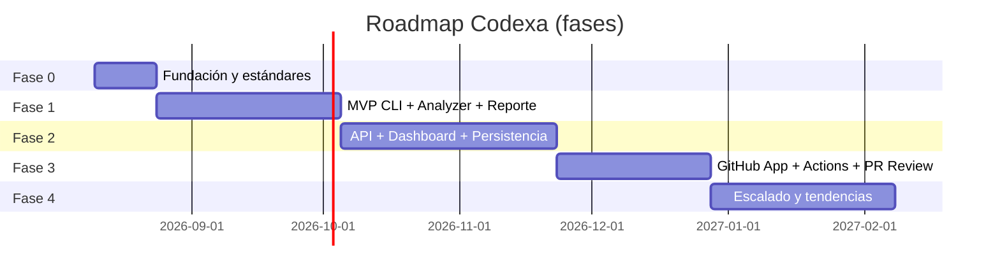
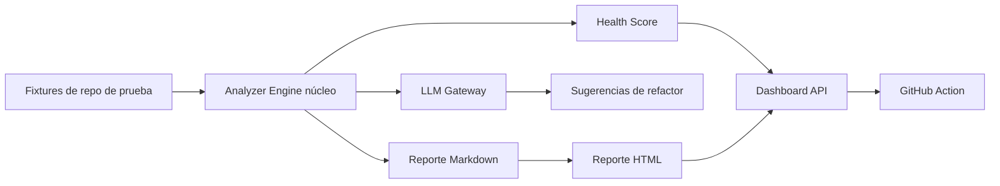
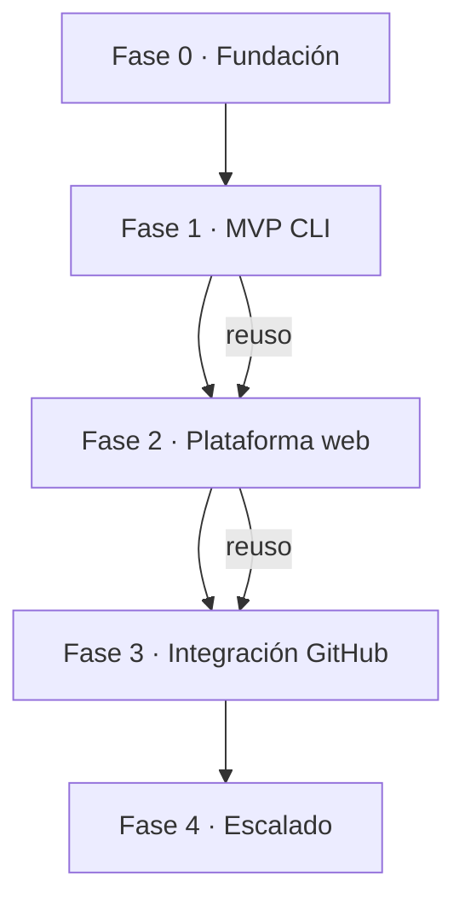

# 01 · Roadmap — Codexa

> **Estado:** Borrador v0.1 · **Última actualización:** 2026-08-05
> **Documentos relacionados:** [00-Project-Overview](00-Project-Overview.md) · [02-Product-Requirements](02-Product-Requirements.md) · [03-System-Architecture](03-System-Architecture.md) · [04-Technology-Stack](04-Technology-Stack.md)

---

## 1. Filosofía del roadmap

El roadmap de Codexa sigue tres principios:

1. **Valor primero en la línea de comandos.** Antes de construir el dashboard, debe existir un
   CLI que produzca un reporte útil. Todo lo demás es una mejora sobre ese núcleo.
2. **Entregas verticales, no horizontales.** Cada fase termina con algo *usable de punta a punta*,
   no con capas de infraestructura sin producto.
3. **Gates de calidad.** Cada fase tiene criterios de salida explícitos. No se avanza con una fase
   "a medias" si no se cumple la Definition of Done de [`05-Coding-Standards.md`](05-Coding-Standards.md).

---

## 2. Vista general de fases



| Fase | Nombre          | Duración estimada | Resultado principal                                  |
| ---- | --------------- | ----------------- | ---------------------------------------------------- |
| 0    | Fundación       | ~2 semanas        | Repo, estándares, CI básica                          |
| 1    | MVP (CLI)       | ~6 semanas        | Auditoría completa vía CLI con reporte Markdown/HTML |
| 2    | Plataforma web  | ~7 semanas        | API + dashboard + persistencia + auth                |
| 3    | Integración GitHub | ~5 semanas     | GitHub App, Actions y revisión de PRs                |
| 4    | Escalado        | ~6 semanas        | Multi-repo, tendencias, comparación entre commits    |

---

## 3. Fase 0 — Fundación

**Objetivo:** dejar el repositorio listo para desarrollar con calidad desde el día 1.

### Alcance

| Ítem | Descripción                                                      | Criterio de salida                                    |
| ---- | ---------------------------------------------------------------- | ----------------------------------------------------- |
| F0-01 | Estructura de monorepo (apps/api, apps/cli, frontend, docs, scripts) | Estructura definida en [06-Folder-Structure]          |
| F0-02 | Estándares de código y herramienta de formato                        | ESLint + Prettier, scripts `lint`/`format`             |
| F0-03 | Convención de commits y ramas                                    | Guía en [05-Coding-Standards](05-Coding-Standards.md) |
| F0-04 | CI básica (build + lint + tests)                                 | GitHub Actions green en cada PR                       |
| F0-05 | Variables de entorno documentadas                                | `.env.example` y [18-Environment-Variables]           |
| F0-06 | Plantilla de PR e issues                                         | `.github/PULL_REQUEST_TEMPLATE.md`, issue templates   |

### Entregable

Un PR que abra el repo: estructura, CI verde, badges, y documentación de la Entrega 1.

---

## 4. Fase 1 — MVP (CLI)

**Objetivo:** auditar un repositorio desde la terminal y generar un reporte priorizado. **Es la
fase más crítica del proyecto**: aquí se valida que la combinación AST + LLM funciona.

### Alcance

| Ítem | Descripción                                                        | Prioridad |
| ---- | ------------------------------------------------------------------ | --------- |
| F1-01 | Comando `audit --path <repo> --provider <llm>`                     | P0        |
| F1-02 | Recolector: detectar lenguaje, estructura, dependencias            | P0        |
| F1-03 | Analizador AST de TypeScript: dead code, complejidad ciclomática, símbolos | P0  |
| F1-04 | Analizador ESLint: problemas de estilo/lint en JS/TS               | P0        |
| F1-05 | `npm audit`: dependencias vulnerables                              | P0        |
| F1-06 | Detector de funciones sin tests (por símbolo)                      | P0        |
| F1-07 | Unificador de hallazgos + deduplicación                            | P0        |
| F1-08 | Cálculo de Health Score reproducible                               | P0        |
| F1-09 | LLM Gateway con un proveedor (OpenAI) y contrato extensible        | P0        |
| F1-10 | Reporte Markdown y HTML                                            | P0        |
| F1-11 | Exportación de sugerencias de refactor con citación (archivo:línea) | P1      |
| F1-12 | Fixtures de repositorios de prueba (fixtures determinísticos)      | P0        |
| F1-13 | Evaluación de precisión sobre fixtures (métrica de éxito)          | P1        |

### Criterios de salida de la Fase 1

- [ ] `codexa audit` corre sobre un repo real de ejemplo y produce un reporte Markdown en < 60 s.
- [ ] El Health Score es determinístico para un mismo repo + mismo proveedor (con caché).
- [ ] Precisión de dead code ≥ 95 % sobre el fixture (sin falsos positivos comprobados).
- [ ] Cada hallazgo tiene `archivo:línea` y severidad.
- [ ] Reporte HTML visualmente presentable (suficiente para capturas de portafolio).
- [ ] Tests unitarios ≥ 60 % en el Analyzer Engine.

### Demo objetivo

```
┌────────────────────────────────────────────┐
│  Health Score          87%  (▲ +3 vs base)│
│  Critical Issues        2                  │
│  Medium                13                  │
│  Technical Debt       ~8 horas             │
│  Dead Code             14 archivos         │
│  Missing Tests         23 métodos          │
│                                            │
│  Sugerencias:                              │
│  ✓ Divide UserService (src/Services/…)     │
│  ✓ Extrae PaymentLogic  (src/Payments/…)   │
│  ✓ Elimina código duplicado (3 sitios)     │
└────────────────────────────────────────────┘
```

---

## 5. Fase 2 — Plataforma web

**Objetivo:** convertir el CLI en un producto con interfaz: API, dashboard y persistencia.

### Alcance

| Ítem | Descripción                                                       | Prioridad |
| ---- | ----------------------------------------------------------------- | --------- |
| F2-01 | API REST con Clean Architecture + CQRS (`@nestjs/cqrs`)          | P0        |
| F2-02 | Persistencia PostgreSQL (auditorías, repositorios, hallazgos)     | P0        |
| F2-03 | Redis para caché de resultados LLM y rate limiting                | P0        |
| F2-04 | Autenticación JWT + registro de usuarios                           | P0        |
| F2-05 | Dashboard: lista de repositorios + resumen de última auditoría    | P0        |
| F2-06 | Dashboard: detalle de hallazgos y sugerencias                      | P1        |
| F2-07 | Historial de auditorías por repositorio                           | P1        |
| F2-08 | Exportación de reportes en PDF                                     | P1        |
| F2-09 | Cola de auditorías (process jobs) con Redis                       | P2        |
| F2-10 | Tendencias del Health Score en el tiempo (inicio)                 | P2        |

### Criterios de salida de la Fase 2

- [ ] Un usuario se registra, crea un repositorio y dispara una auditoría desde el dashboard.
- [ ] El dashboard muestra el reporte completo con el mismo contenido que el CLI.
- [ ] Los reportes quedan persistidos y consultables en el historial.
- [ ] La API expone el contrato documentado en [14-API-Documentation].
- [ ] Autenticación con rate limiting y refresh de tokens.

---

## 6. Fase 3 — Integración GitHub

**Objetivo:** automatizar las auditorías dentro del flujo de desarrollo del usuario.

### Alcance

| Ítem | Descripción                                                  | Prioridad |
| ---- | ------------------------------------------------------------ | --------- |
| F3-01 | GitHub App que lee repositorios con permisos mínimos         | P0        |
| F3-02 | GitHub Action `codexa/audit` reutilizable                     | P0        |
| F3-03 | Comentario de resumen de auditoría en el PR                  | P1        |
| F3-04 | PR Review: comentarios inline en líneas con hallazgos        | P1        |
| F3-05 | Webhooks para auditorías automáticas al hacer push           | P2        |
| F3-06 | Reporte en el "Checks" de GitHub                             | P2        |

### Criterios de salida de la Fase 3

- [ ] `codexa/audit@v1` disponible en un marketplace público o vía URL de tag.
- [ ] Un repo de demo con el action configurado genera reporte en cada push.
- [ ] Los comentarios de PR citan archivo y línea reales.

---

## 7. Fase 4 — Escalado

**Objetivo:** métricas avanzadas y casos de uso de nivel "producto".

### Alcance

| Ítem | Descripción                                                       | Prioridad |
| ---- | ----------------------------------------------------------------- | --------- |
| F4-01 | Comparación entre commits (diff de Health Score y hallazgos)      | P1        |
| F4-02 | Multi-repo: una organización con N repositorios                   | P1        |
| F4-03 | Umbrales y alertas (si score < X, notificar)                      | P2        |
| F4-04 | Soporte de más lenguajes (Python/PHP opcional)                    | P2        |
| F4-05 | Informes ejecutivos agregados (PDF)                               | P2        |
| F4-06 | Pricing simulado / límites por plan (si se busca producto)        | P2        |

### Criterios de salida de la Fase 4

- [ ] Tendencias visibles en el dashboard para al menos un repo.
- [ ] Documento de arquitectura actualizado tras el escalado.

---

## 8. Backlog priorizado (inicial)



Orden de ejecución sugerido (de arriba hacia abajo): los ítems en nivel superior son
prerrequisitos de los inferiores.

---

## 9. Dependencias entre fases



**Decisión de arquitectura (ver ADR-001 en [03-System-Architecture](03-System-Architecture.md)):**
el Analyzer Engine y el LLM Gateway son librerías compartidas entre el CLI y la API. Esto evita
reescribir el núcleo cuando aparece el dashboard.

---

## 10. Riesgos y mitigación del plan

| Riesgo                               | Impacto | Mitigación                                                    |
| ------------------------------------ | ------- | ------------------------------------------------------------- |
| Costo de LLM en iteraciones de dev   | Medio   | Caché en disco de respuestas; fixtures con respuestas mockeadas |
| Dependencias de herramientas externas (ESLint/npm audit versiones) | Medio | Pines de versiones en el repo de Codexa |
| El dashboard consume tiempo del MVP   | Alto    | Fase 1 sin UI; el CLI es el MVP y ya demuestra valor          |
| Precisión de dead code insuficiente   | Alto    | Validación con símbolos del compilador; umbrales configurables |

---

## 11. Definición de "Listo" para cada entrega de fase

Toda fase, al cerrarse, debe cumplir:

- [ ] Código revisado en PR con al menos un reviewer.
- [ ] CI verde (build, lint, tests).
- [ ] Tests unitarios en el núcleo con cobertura ≥ 60 %.
- [ ] Documentación afectada actualizada (indexada en `docs/`).
- [ ] Demo grabada o capturas listas para portafolio.
- [ ] Changelog actualizado ([23-Changelog], próxima entrega).

---

## 12. Historial del documento

| Versión | Fecha      | Cambios                              |
| ------- | ---------- | ------------------------------------ |
| v0.1    | 2026-08-05 | Primera versión completa (Entrega 1) |

---

[06-Folder-Structure]: 06-Folder-Structure.md
[14-API-Documentation]: 14-API-Documentation.md
[18-Environment-Variables]: 18-Environment-Variables.md
[23-Changelog]: 23-Changelog.md
