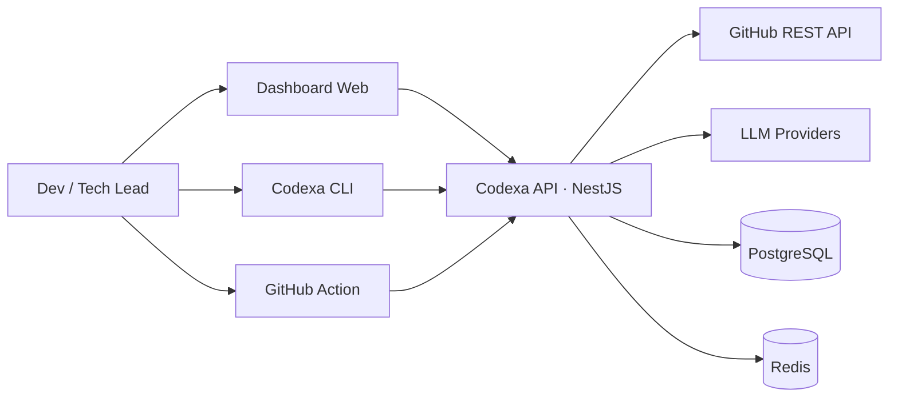
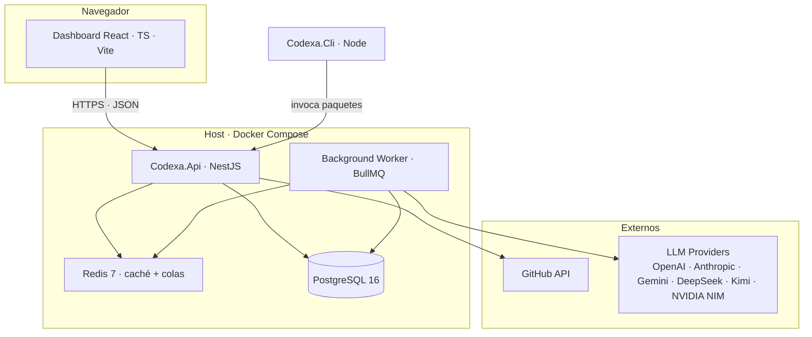
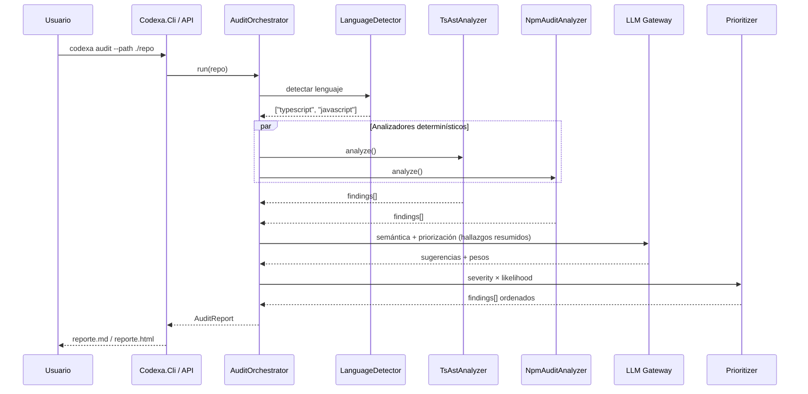
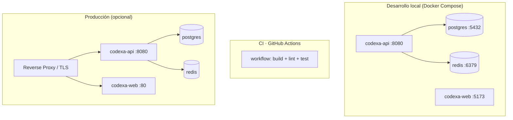
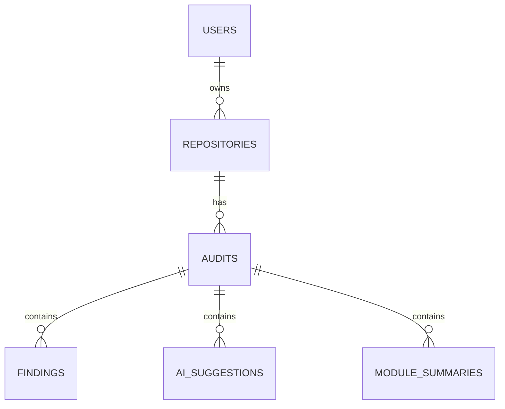

# 03 · System Architecture — Codexa

> **Estado:** Borrador v0.1 · **Última actualización:** 2026-08-05
> **Documentos relacionados:** [00-Project-Overview](00-Project-Overview.md) · [02-Product-Requirements](02-Product-Requirements.md) · [04-Technology-Stack](04-Technology-Stack.md) · [06-Folder-Structure](06-Folder-Structure.md) · [07-Database-Design](07-Database-Design.md) · [10-AI-Engine](10-AI-Engine.md)

---

## 1. Visión general

Codexa se compone de cuatro subsistemas desplegables de forma independiente:

1. **Analyzer Engine** — núcleo determinístico (AST de TypeScript, ESLint, dependencias, coverage).
   Paquete compartido.
2. **LLM Gateway** — abstracción de proveedores de IA con contrato y validación de esquema.
3. **Codexa API** — aplicación NestJS (CQRS) que orquesta auditorías y sirve el dashboard.
4. **Frontend** — dashboard React que consume la API.

La regla arquitectónica más importante (ADR-001): **el núcleo es agnóstico al host**. El CLI y la
API consumen los mismos paquetes; el CLI no es un "segundo producto" sino un front-end de consola.

---

## 2. Vista de contexto (C4 nivel 1)



**Actores externos:** desarrolladores, GitHub, proveedores de LLM.

---

## 3. Vista de contenedores (C4 nivel 2)



| Contenedor        | Responsabilidad                                            | Tecnología              |
| ----------------- | ---------------------------------------------------------- | ----------------------- |
| `Codexa.Cli`      | Auditoría desde terminal; también reporte standalone.      | Node.js 20 + Commander  |
| `Codexa.Api`      | REST, auth, orquestación CQRS.                             | NestJS 10 + @nestjs/cqrs |
| `Background Worker` | Procesa auditorías en cola (Fase 2+).                    | BullMQ (Redis)          |
| `Codexa.Web`      | Dashboard.                                                 | React + Vite            |
| PostgreSQL        | Datos relacionales.                                        | PostgreSQL 16           |
| Redis             | Caché de respuestas LLM, rate limiting, colas.             | Redis 7                 |

---

## 4. Vista de componentes del Analyzer Engine (C4 nivel 3)

```mermaid
flowchart TB
    subgraph Engine["Analyzer Engine (paquete npm)"] 
        ORC[AuditOrchestrator]
        REPO[RepositoryCollector]
        LAN[LanguageDetector]

        subgraph Analyzers["Analizadores implementan IAnalyzer"]
            T[TsAstAnalyzer]
            E[EslintAnalyzer]
            N[NpmAuditAnalyzer]
            C[TestCoverageAnalyzer]
            D[DotnetCliAnalyzer]
        end

        NORM[Normalizer / Deduplicator]
        SCORE[HealthScoreCalculator]
        PRIO[Prioritizer]
    end

    REPO --> LAN
    LAN --> T
    LAN --> E
    LAN --> N
    LAN --> C
    LAN --> D
    ORC --> REPO
    ORC --> Analyzers
    T --> NORM
    E --> NORM
    N --> NORM
    C --> NORM
    D --> NORM
    NORM --> SCORE
    SCORE --> PRIO
    PRIO --> OUT[AuditReport]
```

### Contratos clave

```typescript
// packages/analysis/src/interfaces/analyzer.interface.ts
export type LanguageId = "dotnet" | "typescript" | "javascript" | "unknown";

export type FindingSeverity = "critical" | "medium" | "low";

export interface FileLocation {
  filePath: string;
  line: number;
  column: number;
}

export interface AnalysisContext {
  repositoryPath: string;
  filesByLanguage: Record<LanguageId, string[]>;
  commitSha: string;
  abortSignal: AbortSignal;
}

export interface IAnalyzer {
  readonly name: string;
  readonly version: string;
  readonly supportedLanguages: ReadonlySet<LanguageId>;
  analyze(context: AnalysisContext): Promise<AnalyzerResult>;
}

export interface Finding {
  ruleId: string;
  severity: FindingSeverity;
  likelihood: number; // 0..1
  message: string;
  location: FileLocation;
  metadata?: Record<string, string>;
}

export interface AuditReport {
  metadata: AuditMetadata; // commit, fecha, proveedor, duración
  healthScore: number;
  findings: Finding[];
  suggestions: AiSuggestion[];
  modules: ModuleSummary[];
}
```

---

## 5. Flujo de una auditoría (secuencia)



**Decisión:** la priorización puede correr sin LLM (RB-06 en
[02-Product-Requirements](02-Product-Requirements.md)); el LLM solo enriquece.

---

## 6. Diagrama de despliegue



---

## 7. Decisiones de arquitectura (ADR)

| ID      | Decisión                                              | Decidido | Alternativas descartadas                | Motivo                                                        |
| ------- | ----------------------------------------------------- | -------- | --------------------------------------- | ------------------------------------------------------------- |
| ADR-001 | Núcleo (Engine + Gateway) como paquetes compartidos   | Sí       | Microservicio separado en Fase 1        | El MVP necesita iterar rápido; un solo proceso simplifica despliegue y tests. |
| ADR-002 | CQRS con `@nestjs/cqrs` en la API                     | Sí       | Arquitectura por capas sin CQRS         | Separación clara lecturas/escrituras; nativo de NestJS.       |
| ADR-003 | PostgreSQL como base principal + Redis como complemento | Sí      | SQL Server, MongoDB, solo Redis          | Postgres cubre relacional + JSONB; Redis para caché/colas, no como fuente de verdad. |
| ADR-004 | LLM Gateway con contrato propio y proveedores plugables | Sí      | Llamar directamente a cada SDK por módulo | Aísla dependencias, permite cambiar de proveedor y acotar coste. |
| ADR-004a | Adapter genérico OpenAI-compatible para DeepSeek, Kimi y NVIDIA NIM | Sí | Un adapter por SDK de cada proveedor | DeepSeek, Kimi y NVIDIA NIM exponen Chat Completions; un adapter + presets cubre todos y cualquier endpoint futuro. |
| ADR-005 | Resultados determinísticos sin depender del LLM        | Sí       | Score calculado por el LLM               | Reproducibilidad y confianza; el LLM enriquece pero no define la métrica. |
| ADR-006 | El CLI consume los mismos paquetes que la API          | Sí       | CLI independiente                        | Un solo núcleo que mantener y testear.                          |
| ADR-007 | Reporte normalizado (JSON) + proyecciones (MD/HTML/PDF) | Sí      | Generar MD/HTML directo desde analizadores | Separa datos de presentación; habilita el dashboard sin re-trabajo. |
| ADR-008 | Prisma como ORM                                       | Sí       | TypeORM, Drizzle                        | Tipado generado, migraciones simples y rendimiento suficiente. |
| ADR-009 | Análisis .NET vía procesos externos (`dotnet`)        | Sí       | Integrar Roslyn en proceso Node          | Roslyn es una librería .NET; el shell-out aísla el runtime y mantiene el stack Node puro. |

---

## 8. Seguridad en la arquitectura

- **Perímetro:** la API detrás de reverse proxy TLS en producción.
- **Auth:** JWT (access 15 min, refresh 7 días) firmados con clave privada de app.
- **Claves LLM:** cifradas con AES en repositorio de configuración (documentado en [19-Security]).
- **Entrada no confiable:** validación de rutas (path traversal) y de URLs (SSRF) al clonar.
- **No persistencia de código:** solo métricas y fragmentos de las citas.
- **Rate limiting:** Redis + guard en endpoints de auditoría (NFR-14).

---

## 9. Escalabilidad y rendimiento

| Escenario                            | Estrategia                                                        |
| ------------------------------------ | ----------------------------------------------------------------- |
| Auditorías largas                    | Worker BullMQ en background (Fase 2).                             |
| Coste de LLM                         | Caché de respuestas por `(repo-hash + proveedor + modelo)`.       |
| Dashboard caliente                   | Listado de repositorios con score desde caché Redis (TTL 60 s).   |
| Repos grandes                        | Procesamiento por módulos en paralelo (`Promise.all` por paquete). |
| Degradación por proveedor            | Circuit breaker en el Gateway con fallback a modo sin IA.         |

---

## 10. Base de datos (resumen)

Modelo principal (detalle completo en [07-Database-Design](07-Database-Design.md)):



| Entidad          | Propósito                                        |
| ---------------- | ------------------------------------------------ |
| `User`           | Cuentas y credenciales.                          |
| `Repository`     | Repositorios registrados (local path o GitHub).  |
| `Audit`          | Instancia de auditoría (commit, fecha, score).   |
| `Finding`        | Hallazgos normalizados de una auditoría.         |
| `AiSuggestion`   | Sugerencias de refactor con citación.            |
| `ModuleSummary`  | Resúmenes por módulo (score parcial).            |

---

## 11. Verificación del diseño

| Requisito                    | Cómo se verifica                                        |
| ---------------------------- | ------------------------------------------------------- |
| Núcleo agnóstico al host     | CLI y API usan el mismo paquete; tests compartidos.     |
| Score reproducible           | Test con fixture: auditar 2 veces → mismo score.        |
| Cambio de proveedor sin código | Test de integración con 2 proveedores mock.           |
| Seguridad (path/URL)         | Tests de validación con payloads maliciosos.            |
| Degradación sin IA           | Test con proveedor caído → reporte sin sugerencias, no error. |

---

## 12. Historial del documento

| Versión | Fecha      | Cambios                              |
| ------- | ---------- | ------------------------------------ |
| v0.1    | 2026-08-05 | Primera versión completa (Entrega 2). |
| v0.2    | 2026-08-05 | Migración a NestJS + Prisma (Entrega 3). |

---

[19-Security]: 19-Security.md
