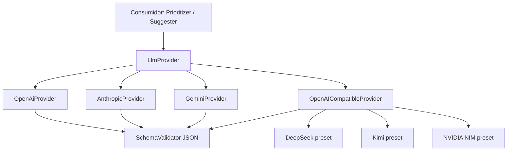

# 04 · Technology Stack — Codexa

> **Estado:** Borrador v0.1 · **Última actualización:** 2026-08-05
> **Documentos relacionados:** [03-System-Architecture](03-System-Architecture.md) · [05-Coding-Standards](05-Coding-Standards.md) · [08-Backend-Architecture](08-Backend-Architecture.md) · [09-Frontend-Architecture](09-Frontend-Architecture.md) · [10-AI-Engine](10-AI-Engine.md)

---

## 1. Principios de selección

Cada tecnología se eligió con estos criterios, en este orden de prioridad:

1. **Un solo lenguaje en todo el stack (TypeScript)** — backend, frontend, CLI y analizadores
   comparten tipos y herramientas. Menos context switches y contratos sincronizados.
2. **Ecosistema de análisis** — la razón de ser de Codexa es analizar código; TypeScript da acceso
   directo al AST (`typescript` compiler API) y a ESLint/npm audit.
3. **Afinidad y madurez del autor** — el proyecto debe poder avanzar rápido y mantenerse.
4. **Coste de operación** — preferir stack auto-hosteado y gratuito (MIT/OSS).
5. **Portabilidad** — desarrollo reproducible en Windows/Linux/macOS vía Docker.

---

## 2. Stack completo

| Capa              | Tecnología                            | Versión   | Propósito                                   |
| ----------------- | ------------------------------------- | --------- | ------------------------------------------- |
| Frontend          | React                                 | 18.x      | UI del dashboard                            |
| Frontend          | TypeScript                            | 5.x       | Tipado estático                             |
| Frontend          | Vite                                  | 6.x       | Dev server y build                          |
| Frontend          | Tailwind CSS                          | 3.4.x     | Estilos utilitarios                         |
| Frontend          | TanStack Query                        | 5.x       | Estado del servidor / caché HTTP            |
| Frontend          | Zustand                               | 5.x       | Estado local de cliente (UI)                |
| Frontend          | React Router                          | 6.x       | Ruteo                                       |
| Frontend          | Vitest + React Testing Library        | 2.x       | Tests unitarios y de componentes            |
| Backend           | NestJS                                | 10.x      | API REST, DI, módulos                       |
| Backend           | Node.js                               | 20 (LTS)  | Runtime                                     |
| Backend           | CQRS (`@nestjs/cqrs`)                 | 10.x      | Orquestación de comandos/queries            |
| Backend           | class-validator + class-transformer   | 0.14      | Validación de DTOs (ValidationPipe)         |
| Backend           | Prisma                                | 5.x       | ORM hacia PostgreSQL                        |
| Backend           | Passport (`@nestjs/passport` + JWT)   | 10.x      | Autenticación                               |
| Backend           | BullMQ                                | 5.x       | Colas de auditoría (Fase 2)                 |
| Datos             | PostgreSQL                            | 16        | Base de datos relacional                    |
| Datos             | Redis                                 | 7         | Caché, rate limiting, colas                 |
| Analizadores      | TypeScript compiler API (`typescript` / `ts-morph`) | 5.x | AST/símbolos de TS/JS            |
| Analizadores      | ESLint                                | 9.x       | Lint de JS/TS                               |
| Analizadores      | npm audit                             | 10.x      | Vulnerabilidades de dependencias JS         |
| Analizadores      | `dotnet` CLI (proceso externo)        | 8.x       | Análisis de repos .NET (opcional)           |
| IA                | OpenAI API (Chat Completions)          | gpt-4o    | Adapter nativo (F1)                        |
| IA                | Anthropic API                          | Claude 3.5| Adapter nativo (F2)                        |
| IA                | Google Gemini API                      | 1.5 Pro   | Adapter nativo (F2)                        |
| IA                | DeepSeek API (OpenAI-compatible)       | deepseek-chat / reasoner | Adapter genérico (free/low-cost) |
| IA                | Kimi · Moonshot AI (OpenAI-compatible) | kimi-k2   | Adapter genérico (free)                    |
| IA                | NVIDIA NIM (OpenAI-compatible)         | llama-3.1 / deepseek-r1 | Adapter genérico (free, rate limits) |
| IA                | Gateway propio `@codexa/ai`            | —         | Abstracción de proveedores + cache         |
| DevOps            | Docker + Docker Compose               | 26 / 2.x  | Entorno reproducible                        |
| DevOps            | GitHub Actions                        | —         | CI/CD                                      |
| Calidad           | Jest (`@nestjs/testing`)              | 29.x      | Tests backend                              |
| Calidad           | ts-jest / tsx                        | —         | Transpilación de tests                      |
| Calidad           | ESLint + Prettier                     | —         | Formato y estilo TS                         |
| CLI               | Commander (`nest-commander`)          | 11.x      | CLI `codexa audit`                          |
| Monorepo          | npm workspaces                        | —         | Paquetes compartidos (`apps/*`, `packages/*`) |

> Las versiones concretas se pinan en `package.json`/`package-lock.json`. Este documento marca
> *mínimos compatibles*.

---

## 3. Detalle por capa

### 3.1 Frontend (React + TypeScript)

| Decisión                    | Elección                              | Motivo                                                       |
| --------------------------- | ------------------------------------- | ------------------------------------------------------------ |
| Build tool                  | Vite                                  | Dev server rápido, HMR, build moderno.                       |
| Estilos                     | Tailwind CSS                          | Rapidez de iteración en dashboard sin escribir CSS a mano.   |
| Estado del servidor         | TanStack Query                        | Caché, refetch, estados de carga sin boilerplate.            |
| Estado de cliente           | Zustand                               | Ligero y simple para UI (filtros, selección).                |
| Fetch de API                | Fetch API estándar + capa `api.ts`    | Evita dependencia extra; base URL y errores centralizados.   |
| Routing                     | React Router                          | Estándar de facto.                                           |
| Tests                       | Vitest + React Testing Library        | Coherente con Vite; RTL promueve tests de comportamiento.    |

**Regla:** los tipos de la API se comparten desde el paquete `@codexa/contracts` (o se generan
desde el OpenAPI de NestJS con `@nestjs/swagger`).

### 3.2 Backend (NestJS + Node 20)

```
apps/
├── api/                   → Aplicación NestJS (módulos por feature)
└── cli/                   → CLI de consola (Commander)
packages/
├── contracts/             → DTOs y tipos compartidos
├── analysis/              → Analyzer Engine (IAnalyzer + implementaciones)
├── ai/                    → LLM Gateway (proveedores)
└── cli-core/              → helpers del CLI (reportes MD/HTML)
```

Justificación de NestJS: módulos, inyección de dependencias, guards/pipes/interceptors nativos y
CQRS como primer ciudadano. El resultado es un monólito modular, testable con `@nestjs/testing`.

### 3.3 Analizadores

| Analizador        | Qué detecta                                      | Forma de integración                     |
| ----------------- | ------------------------------------------------ | ---------------------------------------- |
| `TsAstAnalyzer`   | Dead code, complejidad, símbolos sin uso (TS/JS) | `ts-morph` / TypeScript compiler API     |
| `EslintAnalyzer`  | Problemas de lint en JS/TS                       | Clase `ESLint` (API programática)        |
| `NpmAuditAnalyzer`| Vulnerabilidades (`npm audit --json`)           | `child_process` + parseo JSON            |
| `TestCoverageAnalyzer` | Métodos sin tests                            | Símbolos + heurística de archivos de test |
| `DotnetCliAnalyzer`| Dead code / vulnerabilidades en repos .NET       | `spawn` de `dotnet` CLI (opcional)       |

Todos implementan `IAnalyzer` (contrato en [03-System-Architecture](03-System-Architecture.md)).
El framework de plugins permite añadir analizadores sin tocar el orquestador.

### 3.4 LLM Gateway



| Aspecto           | Diseño                                                     |
| ----------------- | ---------------------------------------------------------- |
| Abstracción       | Interfaz `LlmProvider` con `complete(system, user, ...)`.  |
| Configuración     | `LLM_PROVIDER`, `LLM_API_KEY`, `LLM_BASE_URL`, `LLM_MODEL_*` vía env/config. |
| Validación        | Respuestas validadas contra esquema JSON (zod).            |
| Caché             | Clave `hash(mensaje) + proveedor + modelo` en Redis/archivo. |
| Presupuesto       | `maxInputTokens`, `maxOutputTokens`, timeout por llamada.   |
| Proveedores       | Nativos: OpenAI/Anthropic/Gemini. OpenAI-compatible: DeepSeek, Kimi (Moonshot), NVIDIA NIM, o endpoint custom. |

Detalle en [10-AI-Engine](10-AI-Engine.md).

### 3.5 Datos

| Pieza        | Uso                                                                    |
| ------------ | --------------------------------------------------------------------- |
| PostgreSQL   | Tablas `users`, `repositories`, `audits`, `findings`, `ai_suggestions`, `module_summaries` (vía Prisma). |
| Redis        | Caché de respuestas LLM, bucket de rate limiting, cola BullMQ de auditorías (Fase 2). |

---

## 4. Alternativas descartadas (y por qué)

| Alternativa             | Descartada por                                                        |
| ----------------------- | --------------------------------------------------------------------- |
| Next.js                 | No es necesario SSR para un dashboard privado; Vite simplifica.       |
| .NET / ASP.NET Core     | El autor pidió Nest; además un solo lenguaje (TS) reduce fricción.    |
| TypeORM                 | Prisma genera tipos de base directamente del esquema; migraciones más simples. |
| SQLite                  | Perfecto para prototipos, pero PostgreSQL ofrece JSONB y concurrencia para la plataforma. |
| Solo OpenAI (sin gateway) | Acoplaría el producto a un proveedor; el gateway soporta nativos + OpenAI-compatible (DeepSeek/Kimi/NVIDIA) y es barato de construir. |
| SonarQube como motor     | Licencia/complejidad de despliegue y no permite sugerencias LLM nativas. Codexa lo complementa. |
| Redux                   | Verboso para el tamaño del estado; Zustand cubre el caso.             |
| Axios                   | Fetch nativo + capa propia es suficiente; menos dependencias.         |

---

## 5. Herramientas de desarrollo y calidad

| Herramienta            | Uso                                                        |
| ---------------------- | ---------------------------------------------------------- |
| ESLint                 | Lint de TS (config `@typescript-eslint/recommended`).      |
| Prettier               | Formato automático (aliado con lint-staged).               |
| `tsc --noEmit`         | Type check estricto; falla CI si hay errores de tipo.      |
| Husky + lint-staged    | Hooks de pre-commit (formato en archivos staged).          |
| Jest                   | Tests backend con `@nestjs/testing`.                       |
| Prisma Migrate         | Migraciones versionadas de base de datos.                  |
| GitHub Actions         | Build/lint/test en cada PR.                                |

---

## 6. Política de versiones

- **Node.js**: seguir LTS (actual: 20; migrar a 22 cuando sea LTS).
- **npm**: `package-lock.json` commiteado; `npm ci` en CI.
- **Dependencias**: `Renovate`/`Dependabot` semanal; PRs con `minor`/`patch` auto-mergables si CI pasa.
- **Contenedores**: imágenes base con digest pin en `compose.yml`.

---

## 7. Checklist de adopción (para el dev que empieza)

- [ ] Tener Node 20+ y Docker.
- [ ] `npm install` sin errores.
- [ ] `npx tsc --noEmit` y `npm run lint` limpios.
- [ ] Levantar `docker compose up -d` y correr `npx prisma migrate dev`.
- [ ] Copiar `.env.example` → `.env` y cargar una API key de LLM.
- [ ] Leer [05-Coding-Standards](05-Coding-Standards.md) antes del primer PR.

---

## 8. Historial del documento

| Versión | Fecha      | Cambios                              |
| ------- | ---------- | ------------------------------------ |
| v0.1    | 2026-08-05 | Primera versión completa (Entrega 1). |
| v0.2    | 2026-08-05 | Migración a NestJS + Prisma.         |

---
