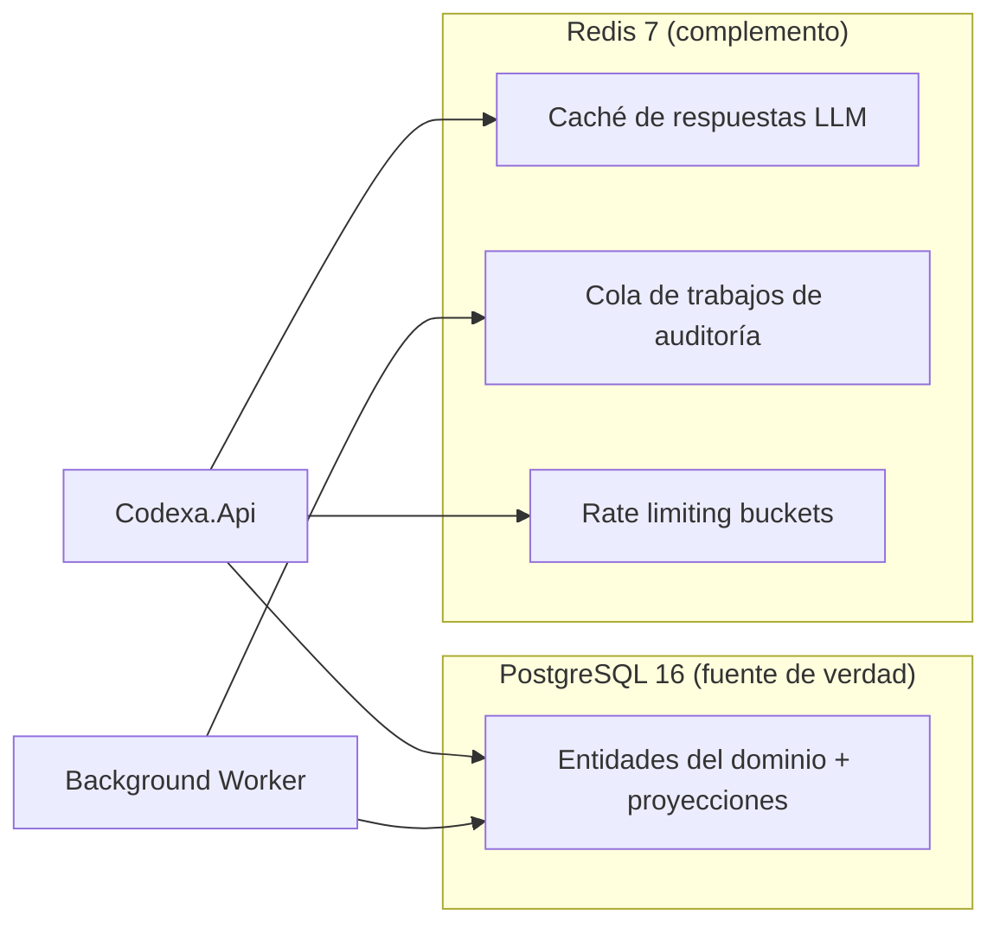
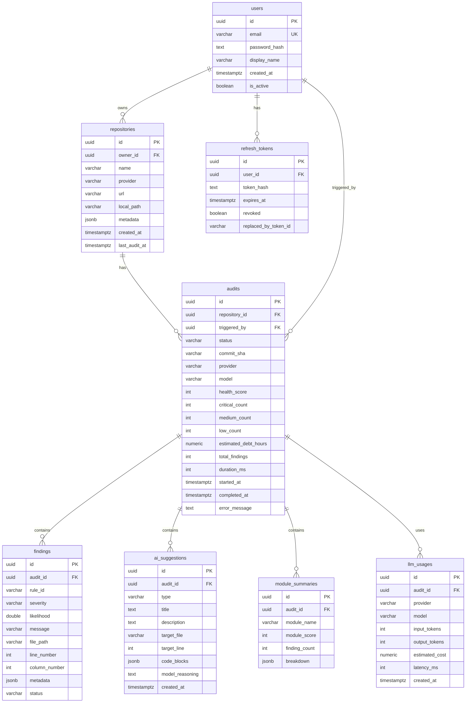
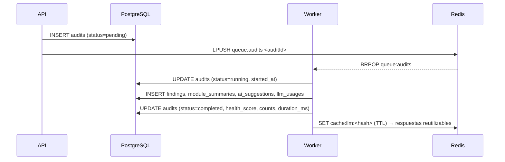

# 07 · Database Design — Codexa

> **Estado:** Borrador v0.1 · **Última actualización:** 2026-08-05
> **Documentos relacionados:** [03-System-Architecture](03-System-Architecture.md) · [06-Folder-Structure](06-Folder-Structure.md) · [08-Backend-Architecture](08-Backend-Architecture.md) · [19-Security] · [18-Environment-Variables]

---

## 1. Panorama

Codexa usa **PostgreSQL 16** como fuente de verdad y **Redis 7** como complemento (caché, colas,
rate limiting). Este documento cubre el modelo relacional en PostgreSQL.



**Regla de oro:** Redis nunca es fuente de verdad. Si un dato importa, vive en PostgreSQL.

---

## 2. Diagrama entidad-relación



---

## 3. Tablas y propósito

| Tabla              | Propósito                                                       | Escrituras | Lecturas frecuentes |
| ------------------ | --------------------------------------------------------------- | ---------- | ------------------- |
| `users`            | Cuentas de usuario.                                             | Baja       | Login, perfil       |
| `refresh_tokens`   | Tokens de refresco (hash, nunca el token en claro).             | Media      | Refresh            |
| `repositories`     | Repositorios registrados por usuario.                           | Media      | Dashboard          |
| `audits`           | Instancia de auditoría + métricas agregadas (denormalizadas).   | Media      | Historial, detalle |
| `findings`         | Hallazgos normalizados (uno por problema).                      | Alta       | Detalle de reporte |
| `ai_suggestions`   | Sugerencias de refactor generadas por IA.                       | Media      | Detalle de reporte |
| `module_summaries` | Resumen por módulo del repo auditado.                           | Media      | Dashboard          |
| `llm_usages`       | Telemetría de uso de LLM (tokens, coste, latencia).             | Alta       | Reportes de coste  |

---

## 4. Diseño de columnas y convenciones

### 4.1 Convenciones generales

- **IDs:** `uuid` generado en la app (`crypto.randomUUID()`). No usar serials para PKs expuestas.
- **Timestamps:** `timestamptz` (PostgreSQL) → mapear a `Date` en TypeScript (serie ISO-8601 en la API).
- **Estados:** `varchar` con enum de la app (`status`), restringido con `CHECK`.
- **Metadatos flexibles:** `jsonb` para datos que no se consultan de forma estructurada.
- **Precisión monetaria:** `numeric(12, 6)` para costes estimados (nunca `float`).
- **Cadenas:** `varchar` con longitud explícita; `text` solo para contenido largo.

### 4.2 Claves y restricciones

- Toda tabla tiene PK `id uuid`.
- Claves foráneas con `ON DELETE CASCADE` para hijos de `audits` (findings, suggestions,
  module_summaries, llm_usages).
- `users.email` único. `repositories(owner_id, provider, url)` único para evitar duplicados.
- `refresh_tokens.token_hash` único.

---

## 5. Índices

| Índice                                    | Tabla            | Razón                                    |
| ----------------------------------------- | ---------------- | ---------------------------------------- |
| `idx_repos_owner` (`owner_id`)            | repositories     | Listar repos de un usuario.              |
| `idx_audits_repo_started` (`repository_id`, `started_at DESC`) | audits | Historial ordenado por fecha.          |
| `idx_findings_audit_severity` (`audit_id`, `severity`) | findings     | Detalle de reporte filtrado por severidad. |
| `idx_findings_audit_file` (`audit_id`, `file_path`) | findings      | Agrupar hallazgos por archivo.          |
| `idx_refresh_tokens_user` (`user_id`)     | refresh_tokens   | Invalidar tokens de un usuario.          |
| `idx_llm_usage_audit` (`audit_id`)        | llm_usages       | Consultar telemetría de una auditoría.  |
| `idx_suggestions_audit` (`audit_id`)      | ai_suggestions   | Cargar sugerencias de un reporte.       |

> Índices compuestos previstos para consultas del dashboard; se validan con `EXPLAIN ANALYZE`
> durante [21-Performance-Optimization].

---

## 6. Diagrama de ejemplo: ciclo de una auditoría



**Consistencia:** el `audits` fila se actualiza al final con los agregados. Los hijos se insertan en
una transacción única. Si el worker falla a mitad, la auditoría queda en `failed` con
`error_message`.

---

## 7. Denormalización deliberada

| Campo en `audits`            | De dónde sale            | Por qué está denormalizado                          |
| ---------------------------- | ------------------------ | --------------------------------------------------- |
| `health_score`               | Cálculo en el Engine     | El dashboard no debe recalcular.                    |
| `critical_count` / `medium_count` / `low_count` | COUNT de findings | Listados sin JOIN pesado.                    |
| `estimated_debt_hours`       | Agregado del Engine      | Visible en tarjetas del dashboard.                  |
| `total_findings`             | COUNT de findings        | Mismo motivo.                                       |

**Compensación:** riesgo de inconsistencia si se insertan `findings` sin actualizar `audits`.
Mitigación: actualización dentro de la misma transacción (sección 6).

---

## 8. Migraciones (Prisma Migrate)

- El esquema vive en `prisma/schema.prisma`; las migraciones se versionan con Prisma Migrate en
  `prisma/migrations/`.
- Nunca editar una migración publicada; crear una nueva.
- Naming: `YYYYMMDDHHMMSS_<descripcion>/` (generado por Prisma).
- En CI: `npx prisma migrate deploy` contra una base efímera para validar.
- Seed: datos de referencia y un usuario demo vía `prisma/seed.ts` (solo en Development).

```bash
npx prisma migrate dev --name add_audit_aggregate
npx prisma migrate deploy   # en entornos no-dev
```

Los tipos generados (`@prisma/client`) son la fuente de tipos de la capa de datos (ver
[08-Backend-Architecture](08-Backend-Architecture.md)).

---

## 9. Redis: esquema de claves

| Clave                                        | Tipo   | TTL     | Uso                                |
| -------------------------------------------- | ------ | ------- | ---------------------------------- |
| `llm:cache:<sha256(prompt+provider+model)>` | String | 24 h    | Respuestas LLM reutilizables.      |
| `rate:audit:<userId>`                        | ZSET   | 1 h     | Ventana deslizante de auditorías.  |
| `queue:audits`                               | List   | —       | Cola de trabajos de auditoría.     |
| `repo:list:<userId>`                         | String | 60 s    | Cache caliente del dashboard.      |

---

## 10. Estrategia de backups (objetivo)

- `pg_dump` diario + WAL archiving (producción opcional, ver [17-Deployment]).
- Restore probado al menos una vez antes de considerar "producción".

---

## 11. Checklist de implementación

- [ ] Migración inicial con `users`, `refresh_tokens`, `repositories`.
- [ ] Migración del agregado `audits` + hijos (`findings`, `ai_suggestions`, `module_summaries`, `llm_usages`).
- [ ] Índices del dashboard creados y validados con `EXPLAIN`.
- [ ] `OnDelete` definido: `Cascade` para hijos de audit; `Restrict` para `audits.triggered_by` → `users`.
- [ ] Test de integración: auditoría completa persiste y consulta correctamente.
- [ ] Seed de usuario demo solo en Development.

---

## 12. Historial del documento

| Versión | Fecha      | Cambios                              |
| ------- | ---------- | ------------------------------------ |
| v0.1    | 2026-08-05 | Primera versión completa (Entrega 2) |

---

[17-Deployment]: 17-Deployment.md
[18-Environment-Variables]: 18-Environment-Variables.md
[19-Security]: 19-Security.md
[21-Performance-Optimization]: 21-Performance-Optimization.md
