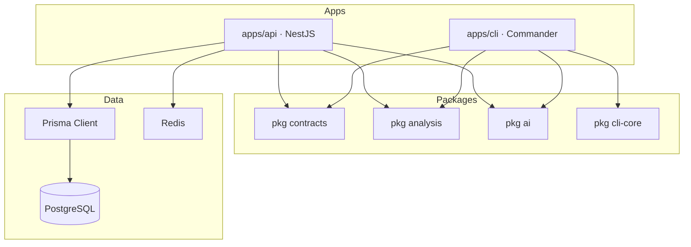

# 08 · Backend Architecture — Codexa

> **Estado:** Borrador v0.1 · **Última actualización:** 2026-08-05
> **Documentos relacionados:** [03-System-Architecture](03-System-Architecture.md) · [06-Folder-Structure](06-Folder-Structure.md) · [07-Database-Design](07-Database-Design.md) · [10-AI-Engine](10-AI-Engine.md) · [12-Authentication-and-Authorization](12-Authentication-and-Authorization.md) · [14-API-Documentation](14-API-Documentation.md)

---

## 1. Visión general

El backend de Codexa es una API **NestJS 10** (Node.js 20, TypeScript) que sigue un **monólito
modular** con **CQRS** (`@nestjs/cqrs`). Tres objetivos guían el diseño:

1. **Módulos por feature:** cada dominio (auth, users, repositories, audits, ci) es un módulo
   NestJS autocontenido.
2. **Núcleo compartido:** la API y el CLI usan los mismos paquetes (`@codexa/analysis`,
   `@codexa/ai`) (ADR-001/006 en [03-System-Architecture](03-System-Architecture.md)).
3. **Evolución incremental:** de una API síncrona (Fase 1) a un worker BullMQ (Fase 2) sin
   reescribir los módulos.

---

## 2. Mapa de dependencias



**Regla de dirección de dependencias:** las apps dependen de los paquetes; los paquetes nunca
dependen de las apps. `packages/analysis` y `packages/ai` no conocen HTTP ni Prisma.

---

## 3. Módulo de ejemplo — Auditorías

### 3.1 Definición del módulo

```typescript
// apps/api/src/modules/audits/audits.module.ts
import { Module } from '@nestjs/common';
import { CqrsModule } from '@nestjs/cqrs';
import { AuditsController } from './audits.controller';
import { RunAuditHandler } from './commands/run-audit.handler';
import { GetAuditHandler } from './queries/get-audit.handler';
import { GetAuditHistoryHandler } from './queries/get-audit-history.handler';
import { PrismaModule } from '../../common/prisma/prisma.module';

@Module({
  imports: [CqrsModule, PrismaModule],
  controllers: [AuditsController],
  providers: [
    RunAuditHandler,
    GetAuditHandler,
    GetAuditHistoryHandler,
  ],
  exports: [],
})
export class AuditsModule {}
```

### 3.2 Comando con `@nestjs/cqrs`

```typescript
// commands/run-audit.command.ts
export class RunAuditCommand {
  constructor(
    public readonly repositoryId: string,
    public readonly provider?: string,
    public readonly model?: string,
  ) {}
}

// commands/run-audit.handler.ts
import { CommandHandler, ICommandHandler } from '@nestjs/cqrs';
import { AuditService } from '../audits.service';
import { RunAuditCommand } from './run-audit.command';

@CommandHandler(RunAuditCommand)
export class RunAuditHandler implements ICommandHandler<RunAuditCommand> {
  constructor(private readonly audits: AuditService) {}

  async execute(command: RunAuditCommand) {
    return this.audits.run(command.repositoryId, command.provider, command.model);
  }
}
```

### 3.3 Query

```typescript
// queries/get-audit-history.handler.ts
import { QueryHandler, IQueryHandler } from '@nestjs/cqrs';

export class GetAuditHistoryQuery {
  constructor(
    public readonly repositoryId: string,
    public readonly ownerId: string,
    public readonly page: number = 1,
    public readonly pageSize: number = 20,
  ) {}
}

@QueryHandler(GetAuditHistoryQuery)
export class GetAuditHistoryHandler implements IQueryHandler<GetAuditHistoryQuery> {
  constructor(private readonly prisma: PrismaService) {}

  async execute(query: GetAuditHistoryQuery) {
    const where = { repository: { id: query.repositoryId, ownerId: query.ownerId } };
    const [items, totalCount] = await Promise.all([
      this.prisma.audit.findMany({ where, orderBy: { startedAt: 'desc' },
        skip: (query.page - 1) * query.pageSize, take: query.pageSize }),
      this.prisma.audit.count({ where }),
    ]);
    return { items, page: query.page, pageSize: query.pageSize, totalCount };
  }
}
```

### 3.4 Controlador delgado

```typescript
// audits.controller.ts
import { Body, Controller, Get, Param, ParseUUIDPipe, Post, Query, Res } from '@nestjs/common';
import { CommandBus, QueryBus } from '@nestjs/cqrs';
import { CurrentUser } from '../../common/decorators/current-user.decorator';
import { RunAuditCommand } from './commands/run-audit.command';
import { GetAuditQuery } from './queries/get-audit.query';

@Controller('repositories/:repositoryId/audits')
export class AuditsController {
  constructor(
    private readonly commandBus: CommandBus,
    private readonly queryBus: QueryBus,
  ) {}

  @Post()
  async run(
    @Param('repositoryId', ParseUUIDPipe) repositoryId: string,
    @Body() body: RunAuditDto,
    @CurrentUser('id') ownerId: string,
  ) {
    const auditId = await this.commandBus.execute(
      new RunAuditCommand(repositoryId, body.provider, body.model),
    );
    return { auditId, status: 'queued' };
  }

  @Get(':auditId')
  async get(@Param('auditId', ParseUUIDPipe) auditId: string, @CurrentUser('id') ownerId: string) {
    return this.queryBus.execute(new GetAuditQuery(auditId, ownerId));
  }
}
```

> El `ownerId` siempre viene del token (`@CurrentUser`), **nunca** del cuerpo de la petición
> (evita IDOR).

---

## 4. PrismaService y acceso a datos

Prisma se expone como módulo global:

```typescript
// common/prisma/prisma.service.ts
import { Injectable, OnModuleDestroy, OnModuleInit } from '@nestjs/common';
import { PrismaClient } from '@prisma/client';

@Injectable()
export class PrismaService extends PrismaClient implements OnModuleInit, OnModuleDestroy {
  async onModuleInit() {
    await this.$connect();
  }

  async onModuleDestroy() {
    await this.$disconnect();
  }
}

// common/prisma/prisma.module.ts
@Global()
@Module({ providers: [PrismaService], exports: [PrismaService] })
export class PrismaModule {}
```

Reglas:
- Toda la lógica de datos en servicios (`*.service.ts`), no en los handlers directamente salvo
  queries de solo lectura simples.
- Transacciones con `this.prisma.$transaction(...)` para la escritura del agregado de auditoría
  (audit + findings + suggestions).

---

## 5. Pipes, Guards y Filters globales

```typescript
// main.ts
import { ValidationPipe } from '@nestjs/common';

async function bootstrap() {
  const app = await NestFactory.create(AppModule);
  app.useGlobalPipes(new ValidationPipe({ whitelist: true, forbidNonWhitelisted: true, transform: true }));
  app.useGlobalFilters(new ProblemDetailsFilter());
  app.enableCors({ origin: config.CORS_ORIGINS, credentials: true });

  if (config.SWAGGER_ENABLED) {
    const config = new DocumentBuilder().setTitle('Codexa API').setVersion('1.0').build();
    const document = SwaggerModule.createDocument(app, config);
    SwaggerModule.setup('docs', app, document);
  }

  await app.listen(config.PORT);
}
```

| Componente        | Responsabilidad                                   |
| ----------------- | ------------------------------------------------- |
| `ValidationPipe`  | Valida DTOs (class-validator); rechaza campos extra. |
| `ProblemDetailsFilter` | Traduce excepciones Nest → ProblemDetails estándar. |
| `JwtAuthGuard`    | Protege rutas; inyecta `@CurrentUser()`.          |
| `RateLimitGuard`  | Rate limiting por usuario/IP (Redis).             |

---

## 6. Manejo de errores

Flujos esperados → excepciones Nest con `code`:

```typescript
// common/filters/problem-details.filter.ts
export class ProblemDetailsFilter implements ExceptionFilter {
  catch(exception: HttpException | Error, host: ArgumentsHost) {
    const ctx = host.switchToHttp();
    const res = ctx.getResponse<Response>();
    const status = exception instanceof HttpException ? exception.getStatus() : 500;

    const code =
      exception instanceof ServiceException
        ? exception.code
        : 'internal.error';

    res.status(status).json({
      type: `https://api.codexa.dev/errors/${code}`,
      title: exception.message,
      status,
      code,
      traceId: host.getRequest().id,
    });
  }
}
```

`ServiceException` tipada en `@codexa/contracts` se usa en los servicios; el resto se traduce a
`500` con detalle genérico.

---

## 7. Autenticación (resumen)

- `AuthModule` con `JwtStrategy` de Passport y `LocalStrategy` para login.
- `JwtAuthGuard` global opcional; endpoints públicos con `@Public()`.
- Detalle completo en [12-Authentication-and-Authorization](12-Authentication-and-Authorization.md).

```typescript
// auth/strategies/jwt.strategy.ts
@Injectable()
export class JwtStrategy extends PassportStrategy(Strategy) {
  constructor(config: ConfigService) {
    super({
      jwtFromRequest: ExtractJwt.fromAuthHeaderAsBearerToken(),
      ignoreExpiration: false,
      secretOrKey: config.getOrThrow('JWT_SECRET'),
    });
  }

  async validate(payload: { sub: string; email: string }) {
    return { id: payload.sub, email: payload.email };
  }
}
```

---

## 8. Worker de background (Fase 2+)

Auditorías largas se encolan con **BullMQ** (Redis):

```typescript
// audits/queues/audit.processor.ts
@Processor('audit-queue')
export class AuditProcessor {
  constructor(private readonly auditService: AuditService) {}

  @Process('run-audit')
  async handleRunAudit(job: Job<{ auditId: string }>) {
    const { auditId } = job.data;
    try {
      await this.auditService.executeQueuedAudit(auditId);
    } catch (err) {
      this.logger.error(`Auditoría ${auditId} falló`, err);
      await this.auditService.markFailed(auditId, err.message);
      throw err;
    }
  }
}
```

El comando `RunAuditCommand` solo crea la fila `pending` y encola el job; el worker ejecuta el
`AuditOrchestrator` y persiste resultados.

---

## 9. Seguridad (resumen)

- **JWT:** access (15 min) + refresh rotativo; detalle en
  [12-Authentication-and-Authorization](12-Authentication-and-Authorization.md).
- **Rate limiting:** guard con Redis por usuario/IP en auditorías (NFR-14).
- **Validación de entrada:** `ValidationPipe` + reglas de path/URL en el CLI y la API.
- **Claves LLM:** solo en el servidor, cifradas en el secret store ([19-Security]).

---

## 10. Testing del backend

- Unit: servicios y handlers con `@nestjs/testing` (módulos de testing + `jest.fn()`).
- Integración: `supertest` + Prisma contra Postgres (Testcontainers o Postgres local).
- Patrón AAA y Given_When_Then en [05-Coding-Standards](05-Coding-Standards.md).
- Pipeline completo: ver [16-Testing-Strategy].

---

## 11. Checklist de implementación

- [ ] Bootstrap NestJS con `ValidationPipe`, `ProblemDetailsFilter` y Swagger.
- [ ] `PrismaModule` global + `schema.prisma` inicial.
- [ ] Módulo `audits` con `RunAuditCommand`, queries de detalle e historial.
- [ ] Módulo `repositories` (CRUD con propiedad de usuario).
- [ ] Módulo `auth` con JWT (ver [12-Authentication-and-Authorization]).
- [ ] `@CurrentUser` inyectado en todos los handlers; checks de propiedad.
- [ ] Tests de integración del flujo de auditoría (e2e).

---

## 12. Historial del documento

| Versión | Fecha      | Cambios                              |
| ------- | ---------- | ------------------------------------ |
| v0.1    | 2026-08-05 | Primera versión completa (Entrega 2). |
| v0.2    | 2026-08-05 | Migración a NestJS + CQRS + Prisma.  |

---

[12-Authentication-and-Authorization]: 12-Authentication-and-Authorization.md
[16-Testing-Strategy]: 16-Testing-Strategy.md
[19-Security]: 19-Security.md
