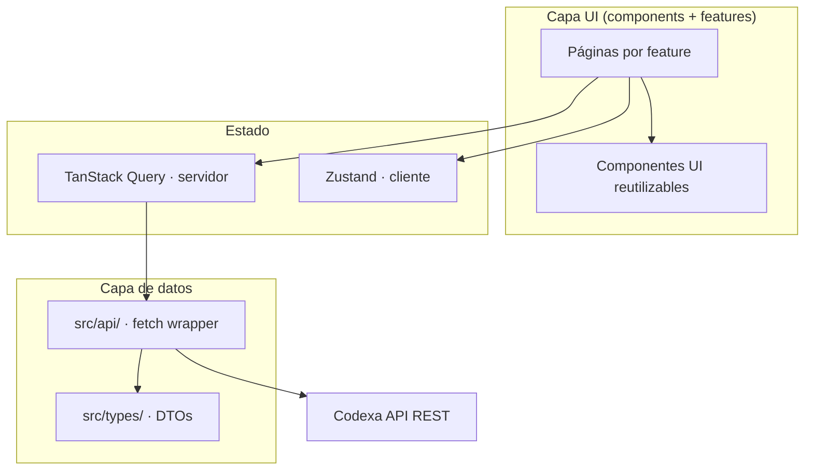

# 09 · Frontend Architecture — Codexa

> **Estado:** Borrador v0.1 · **Última actualización:** 2026-08-05
> **Documentos relacionados:** [04-Technology-Stack](04-Technology-Stack.md) · [05-Coding-Standards](05-Coding-Standards.md) · [06-Folder-Structure](06-Folder-Structure.md) · [14-API-Documentation] · [15-UI-UX-Design]

---

## 1. Visión general

El frontend es una **SPA** construida con **React 18 + TypeScript + Vite + Tailwind CSS**. Es un
dashboard privado para el dueño de los repositorios: registra repos, lanza auditorías, consulta
reportes e historial.



---

## 2. Principios

1. **Feature-first:** el código se agrupa por módulo de producto (`features/`), no por tipo.
2. **Contenedores delgados y componentes puros:** las páginas "conectan" datos; los componentes
   solo reciben props y emiten eventos.
3. **Una sola fuente de datos HTTP:** todo pasa por `src/api/`; los componentes nunca llaman a
   `fetch` directamente.
4. **Estado de servidor ≠ estado de cliente:** TanStack Query para datos del API; Zustand solo para
   UI y sesión.
5. **Accesible por defecto:** WCAG 2.1 AA básico (ver [05-Coding-Standards](05-Coding-Standards.md) §4.6).

---

## 3. Ruteo

`src/routes.tsx` define las rutas con React Router. Carga diferida por feature (lazy).

```tsx
export const routes = createBrowserRouter([
  {
    path: "/",
    element: <AppLayout />,
    children: [
      { index: true, element: <DashboardPage /> },
      { path: "repositories", element: <RepositoriesPage /> },
      { path: "repositories/:id", element: <RepositoryDetailPage /> },
      { path: "audits/:id", element: <AuditDetailPage /> },
      { path: "login", element: <LoginPage /> },
      { path: "register", element: <RegisterPage /> },
    ],
  },
]);
```

| Ruta                    | Feature      | Acceso        |
| ----------------------- | ------------ | ------------- |
| `/`                     | dashboard    | Autenticado   |
| `/repositories`         | repositories | Autenticado   |
| `/repositories/:id`     | repositories | Autenticado   |
| `/audits/:id`           | audit        | Autenticado   |
| `/login`, `/register`   | auth         | Público       |

Un `RequireAuth` wrapper redirige a `/login` si no hay sesión (desde `authStore`).

---

## 4. Capa de datos — `src/api/`

Wrapper de `fetch` con base URL, token y errores tipados.

```ts
// src/api/client.ts
export class ApiError extends Error {
  constructor(public status: number, public code: string, message: string) {
    super(message);
  }
}

export async function api<T>(path: string, init?: RequestInit): Promise<T> {
  const token = authStore.getState().accessToken;
  const res = await fetch(`${import.meta.env.VITE_API_URL}${path}`, {
    ...init,
    headers: {
      "Content-Type": "application/json",
      ...(token ? { Authorization: `Bearer ${token}` } : {}),
      ...init?.headers,
    },
  });

  if (!res.ok) {
    const body = await res.json().catch(() => null);
    throw new ApiError(res.status, body?.code ?? "unknown", body?.detail ?? res.statusText);
  }
  return res.json() as Promise<T>;
}
```

Endpoints por dominio en `src/api/audits.ts`, `src/api/repositories.ts`, `src/api/auth.ts`.

### Manejo de 401 (refresh)

Un interceptor en `api/client.ts` reintenta una vez tras refrescar el token:

```ts
if (res.status === 401 && !retried) {
  await authStore.getState().refresh();
  return api<T>(path, { ...init, retried: true } as RequestInit);
}
```

---

## 5. Estado

### 5.1 Estado de servidor — TanStack Query

- Queries con claves semánticas: `["repositories"]`, `["audits", repoId]`, `["audit", auditId]`.
- `staleTime` corto (30 s) para datos vivos; `gcTime` largo para reportes abiertos.
- Mutaciones con `useMutation` + invalidación de claves afectadas.

```ts
// src/features/dashboard/DashboardPage.tsx
const { data, isLoading, error } = useQuery({
  queryKey: ["repositories", { ownerId }],
  queryFn: () => getRepositories(ownerId),
});

const runAudit = useMutation({
  mutationFn: (repoId: string) => startAudit(repoId),
  onSuccess: () => queryClient.invalidateQueries({ queryKey: ["audits"] }),
});
```

### 5.2 Estado de cliente — Zustand

```ts
// src/store/authStore.ts
interface AuthState {
  user: UserDto | null;
  accessToken: string | null;
  login: (email: string, password: string) => Promise<void>;
  logout: () => void;
  refresh: () => Promise<void>;
}
```

Regla: **nada de datos del servidor en Zustand** (solo sesión, filtros de UI, tema).

---

## 6. Componentes UI — `src/components/`

### 6.1 Capas

| Carpeta            | Contenido                                             | Reutilizable |
| ------------------ | ----------------------------------------------------- | ----------- |
| `components/ui/`   | Primitivos: `Button`, `Badge`, `Card`, `Table`, `Select` | Sí (cualquier feature) |
| `components/score/`| `HealthScoreRing`, `SeverityBadge`, `MetricCard`      | Sí          |
| `components/layout/`| `Sidebar`, `Header`, `PageContainer`, `RequireAuth`   | Sí          |

### 6.2 Ejemplo de primitivo

```tsx
// src/components/ui/Badge.tsx
type Severity = "critical" | "medium" | "low";

const styles: Record<Severity, string> = {
  critical: "bg-red-100 text-red-700",
  medium: "bg-amber-100 text-amber-700",
  low: "bg-slate-100 text-slate-600",
};

export function Badge({ severity, children }: { severity: Severity; children: React.ReactNode }) {
  return <span className={`rounded-full px-2 py-0.5 text-xs font-medium ${styles[severity]}`}>{children}</span>;
}
```

### 6.3 Patrón contenedor / presentacional

```tsx
// Contenedor (conecta datos)
export function RepositoriesPage() {
  const { data: repos } = useQuery({ queryKey: ["repositories"], queryFn: listRepositories });
  return <RepositoryGrid repositories={repos} onRunAudit={runAudit.mutate} />;
}

// Presentacional (solo props)
function RepositoryGrid({ repositories, onRunAudit }: Props) {
  // sin fetch, sin stores
}
```

---

## 7. Tipos — `src/types/`

DTOs espejo de la API. Un contrato por endpoint.

```ts
// src/types/api.ts
export interface AuditReportDto {
  id: string;
  repositoryId: string;
  status: "pending" | "running" | "completed" | "failed";
  healthScore: number;
  criticalCount: number;
  mediumCount: number;
  lowCount: number;
  estimatedDebtHours: number;
  startedAt: string;
  completedAt: string | null;
}

export interface FindingDto {
  id: string;
  ruleId: string;
  severity: "critical" | "medium" | "low";
  message: string;
  filePath: string;
  lineNumber: number;
}

export interface AiSuggestionDto {
  id: string;
  type: string;
  title: string;
  description: string;
  targetFile: string;
  targetLine: number;
}
```

> Mantener sincronizados con los DTOs de la API NestJS. Si hay generación automática
> (Swagger/OpenAPI), ver [14-API-Documentation]; mientras tanto, review manual en cada cambio
> de contrato.

---

## 8. Estilos y temas

- Tailwind con tokens en `tailwind.config.ts` (paleta, tipografía, radios).
- Colores por severidad centralizados: `red`/`amber`/`slate` (ver `Badge`).
- `styles/index.css` con directivas de Tailwind y variables CSS para temas.

Detalle visual completo (layout, componentes, estados de carga/vacío) en
[15-UI-UX-Design].

---

## 9. Testing del frontend

- Vitest + React Testing Library; tests junto al componente.
- Casos obligatorios: render de página con datos, estado de carga, estado de error, interacción
  (lanzar auditoría, filtrar severidad).
- Mock de `src/api/` con `vi.mock`; verificar comportamiento en el DOM (roles).

```ts
// src/features/audit/AuditReportView.test.tsx
it("muestra hallazgos críticos primero", async () => {
  vi.mock("../../api/audits", () => ({ getAudit: vi.fn().mockResolvedValue(fixture) }));
  render(<AuditReportView auditId="a1" />);
  const first = await screen.findAllByRole("listitem");
  expect(first[0]).toHaveTextContent("critical");
});
```

---

## 10. Checklist de implementación

- [ ] Vite + TS + Tailwind + ESLint/Prettier funcionando.
- [ ] Capa `api/` con wrapper, errores tipados y refresh de token.
- [ ] Tipos de API en `src/types/`.
- [ ] Ruteo con lazy loading y `RequireAuth`.
- [ ] Página dashboard con listado de repositorios y últimos scores.
- [ ] Página de detalle de auditoría con hallazgos y sugerencias.
- [ ] Tests de los flujos críticos (login, listado, lanzar auditoría).

---

## 11. Historial del documento

| Versión | Fecha      | Cambios                              |
| ------- | ---------- | ------------------------------------ |
| v0.1    | 2026-08-05 | Primera versión completa (Entrega 2) |

---

[14-API-Documentation]: 14-API-Documentation.md
[15-UI-UX-Design]: 15-UI-UX-Design.md
