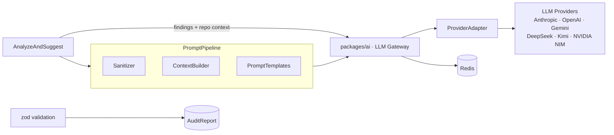

# 10 · AI Engine — Codexa

> **Estado:** Borrador v0.1 · **Última actualización:** 2026-08-05
> **Documentos relacionados:** [03-System-Architecture](03-System-Architecture.md) · [08-Backend-Architecture](08-Backend-Architecture.md) · [11-Code-Analyzer](11-Code-Analyzer.md) · [14-API-Documentation](14-API-Documentation.md) · [19-Security]

---

## 1. Visión general

El **AI Engine** transforma findings técnicos de `@codexa/analysis` en **sugerencias accionables
con prioridad**: títulos, descripciones, referencias de archivo/línea y bloques de código de
refactorización. Vive en `packages/ai` (agente IA) y es consumido tanto por la API (auditorías
en la nube) como por el CLI (auditorías locales).

Principios:
- **Determinista en los datos, probabilístico en el lenguaje:** todo lo medible lo hace
  `@codexa/analysis`; la IA solo redacta y propone fixes.
- **JSON de entrada y salida:** entrada enriquecida + instrucciones; salida con validación de
  esquema (`zod`).
- **Racionalización de costes:** `Mini` para clasificación/filtrado barato; `Pro` solo para
  sugerencias sobre findings con severidad `high`/`critical`.
- **Nunca se envían secretos** al proveedor: sanitizado antes de armar el prompt.

---

## 2. Arquitectura



---

## 3. Capas

| Capa                    | Ubicación                        | Responsabilidad                                    |
| ----------------------- | -------------------------------- | -------------------------------------------------- |
| **Orquestación**        | `packages/ai/src`                | Pipeline `AnalyzeAndSuggest`, politicas de coste.  |
| **Prompt engineering**  | `packages/ai/src/prompt`         | Construcción de mensajes por severidad.            |
| **Proveedores**         | `packages/ai/src/providers`      | Adapters nativos + preset OpenAI-compatible.       |
| **Sanitización**        | `packages/ai/src/sanitize`       | Eliminación de secretos y PII.                     |

---

## 4. Provider adapter

Interfaz única; cada proveedor es un adapter:

```typescript
// providers/llm-provider.ts
export type ProviderKind =
  | 'anthropic'
  | 'openai'
  | 'gemini'
  | 'openai-compatible';

export interface LlmProvider {
  readonly kind: ProviderKind;
  complete(params: { system: string; user: string; maxTokens?: number; model?: string }):
    Promise<LlmResponse>;
}
```

### 4.1 Adapters nativos

| Adapter                | SDK                          | `kind`            |
| ---------------------- | ---------------------------- | ----------------- |
| `AnthropicProvider`    | `@anthropic-ai/sdk`          | `anthropic`       |
| `OpenAiProvider`       | `openai`                     | `openai`          |
| `GeminiProvider`       | `@google/generative-ai`      | `gemini`          |

```typescript
// providers/anthropic.provider.ts
import Anthropic from '@anthropic-ai/sdk';

@Injectable()
export class AnthropicProvider implements LlmProvider {
  readonly kind = 'anthropic' as const;
  private client: Anthropic;

  constructor(private readonly config: ConfigService) {
    this.client = new Anthropic({ apiKey: config.getOrThrow('ANTHROPIC_API_KEY') });
  }

  async complete({ system, user, maxTokens, model }) {
    const res = await this.client.messages.create({
      model: model ?? 'claude-sonnet-4-5',
      max_tokens: maxTokens ?? 2048,
      system,
      messages: [{ role: 'user', content: user }],
    });
    return { text: res.content.map((b) => b.text ?? '').join('') };
  }
}
```

### 4.2 Adapter OpenAI-compatible (DeepSeek, Kimi, NVIDIA NIM, y más)

DeepSeek, Kimi (Moonshot) y NVIDIA NIM exponen una API **compatible con Chat Completions de
OpenAI**. Un único adapter cubre todos (y cualquier endpoint futuro) configurando `baseURL`:

```typescript
// providers/openai-compatible.provider.ts
import OpenAI from 'openai';

@Injectable()
export class OpenAICompatibleProvider implements LlmProvider {
  readonly kind = 'openai-compatible' as const;
  private client: OpenAI;

  constructor(private readonly config: ConfigService) {
    this.client = new OpenAI({
      apiKey: config.getOrThrow('LLM_API_KEY'),
      baseURL: config.getOrThrow('LLM_BASE_URL'), // endpoint del proveedor
    });
  }

  async complete({ system, user, maxTokens, model }) {
    const res = await this.client.chat.completions.create({
      model: model ?? this.config.getOrThrow('LLM_MODEL_PRO'),
      max_tokens: maxTokens ?? 2048,
      messages: [
        { role: 'system', content: system },
        { role: 'user', content: user },
      ],
    });
    return { text: res.choices[0]?.message?.content ?? '' };
  }
}
```

### 4.3 Presets por proveedor

Los presets son config de fábrica (baseURL + modelos por defecto) sobre el adapter
OpenAI-compatible. En `docs/18-Environment-Variables.md` §6 hay ejemplos:

| Provider      | `LLM_BASE_URL` (ejemplo)            | Modelos por defecto (ejemplo)              |
| ------------- | ----------------------------------- | ------------------------------------------ |
| `deepseek`    | `https://api.deepseek.com/v1`       | `deepseek-chat`, `deepseek-reasoner`       |
| `kimi`        | `https://api.moonshot.cn/v1`        | `kimi-k2`, `moonshot-v1-32k`               |
| `nvidia`      | `https://integrate.api.nvidia.com/v1` | `deepseek-ai/deepseek-r1`, `meta/llama-3.1-405b-instruct` |
| `openai-compatible` | (definida por el usuario)     | (definida por el usuario)                  |

> Los endpoints/modelos se confirman en la documentación de cada proveedor; pueden cambiar.
> Verificar la suscripción free y sus rate limits antes de elegir modelo.

### 4.4 Registro y selección en runtime

```typescript
// providers/provider.factory.ts
const PRESETS: Record<string, Preset> = {
  anthropic: { kind: 'anthropic' },
  openai:    { kind: 'openai' },
  gemini:    { kind: 'gemini' },
  deepseek:  { kind: 'openai-compatible', baseUrl: 'https://api.deepseek.com/v1' },
  kimi:      { kind: 'openai-compatible', baseUrl: 'https://api.moonshot.cn/v1' },
  nvidia:    { kind: 'openai-compatible', baseUrl: 'https://integrate.api.nvidia.com/v1' },
  'openai-compatible': { kind: 'openai-compatible', baseUrl: '$LLM_BASE_URL' },
};
```

El provider se selecciona en runtime según `LLM_PROVIDER`; las claves viven solo en el servidor.
Cambiar de proveedor = cambiar configuración, sin tocar código (FR-034).

---

## 5. Pipeline `AnalyzeAndSuggest`

```typescript
// pipeline.ts
export interface AnalyzeAndSuggestInput {
  findings: Finding[];
  repoSummary: RepoSummary;
  language: 'typescript' | 'csharp';
  model?: string;
}

export async function analyzeAndSuggest(input: AnalyzeAndSuggestInput, deps: Dependencies) {
  const candidates = input.findings.filter(
    (f) => f.severity === 'critical' || f.severity === 'high',
  );
  const cheap = await deps.llm.complete({
    system: SYSTEM_PROMPT_MINIFY,
    user: buildMiniPrompt(candidates),
    maxTokens: 512,
  });
  const accepted = parseMini(cheap.text);
  const rich = await deps.llm.complete({
    system: SYSTEM_PROMPT_SUGGEST,
    user: buildSuggestPrompt(accepted, input.repoSummary),
    maxTokens: 2048,
  });
  return validateSuggestions(rich.text); // zod -> AiSuggestion[]
}
```

- Si el presupuesto es `Mini`, la sugerencia es solo el título/clasificación (barato).
- El paso `rich` solo corre si hay findings `high`/`critical` y el usuario no lo desactivó.

---

## 6. Politica de coste y cache

- **Cache en Redis** por `hash(findings)` + versión de prompts: respuestas idénticas no se
  vuelven a pagar (NFR-13).
- **Racionalización:** máximo 10 candidatos por auditoría en el paso `Mini`; máximo 5 en `Pro`.
- **Fallback:** si el proveedor falla, la auditoría se completa con `status: 'degraded'` y
  findings sin sugerencias de IA, nunca se pierde el reporte (ver
  [08-Backend-Architecture](08-Backend-Architecture.md) §8).

---

## 7. Seguridad del prompt

- **Sanitizador:** regex + `parse-diff` para remover tokens, `.env*`, llaves SSH y credenciales
  antes de armar el prompt.
- **Límite de contexto:** solo se incluye el diff/hunk relevante, no el repo completo.
- **No hay datos personales:** nunca se envía email/nombre del owner.

---

## 8. Modelos y config

| Variable           | Uso                                    | Default            |
| ------------------ | -------------------------------------- | ------------------ |
| `LLM_PROVIDER`     | Proveedor activo                       | `anthropic`        |
| `LLM_API_KEY`      | Clave del proveedor (server-only)      | —                  |
| `ANTHROPIC_API_KEY`| Clave Anthropic (alias de `LLM_API_KEY`) | —               |
| `LLM_BASE_URL`     | Endpoint para `openai-compatible`      | —                  |
| `LLM_MODEL_MINI`   | Clasificación/filtrado                 | según proveedor    |
| `LLM_MODEL_PRO`    | Sugerencias de refactor                | según proveedor    |

Valores admitidos de `LLM_PROVIDER`: `anthropic` · `openai` · `gemini` · `deepseek` · `kimi` ·
`nvidia` · `openai-compatible`.

> `LLM_API_KEY` es la clave genérica para los adapters OpenAI-compatible (DeepSeek/Kimi/NVIDIA)
> y OpenAI. Los adapters nativos pueden usar variables propias (`OPENAI_API_KEY`,
> `GEMINI_API_KEY`, etc.) si se prefieren aislar.

---

## 9. Testing

- Mocks del adapter (nunca llamar a la API en CI).
- Golden tests para `buildSuggestPrompt` (sanitización).
- Unit tests de `validateSuggestions` con zod (rechaza JSON malformado).
- Test del `ProviderFactory`: cada preset resuelve al adapter y baseURL correctos.
- Detalle: [16-Testing-Strategy].

---

## 10. Checklist de implementación

- [ ] `LlmProvider` + adapters nativos (Anthropic, OpenAI, Gemini).
- [ ] `OpenAICompatibleProvider` con `baseURL` configurable.
- [ ] Presets `deepseek`, `kimi`, `nvidia`, `openai-compatible` en el `ProviderFactory`.
- [ ] Sanitizador y `ContextBuilder` con límite de contexto.
- [ ] Pipeline `analyzeAndSuggest` con política de coste.
- [ ] Cache en Redis con hash de findings + proveedor + modelo.
- [ ] Validación `zod` de `AiSuggestion[]`.
- [ ] Fallback a `degraded` ante error del proveedor.

---

## 11. Historial del documento

| Versión | Fecha      | Cambios                              |
| ------- | ---------- | ------------------------------------ |
| v0.1    | 2026-08-05 | Primera versión completa (Entrega 2). |
| v0.2    | 2026-08-05 | Migración a TypeScript y SDK nativo de Anthropic. |
| v0.3    | 2026-08-05 | Gateway agnóstico: adapter OpenAI-compatible + presets DeepSeek, Kimi, NVIDIA NIM. |

---

[16-Testing-Strategy]: 16-Testing-Strategy.md
[19-Security]: 19-Security.md
