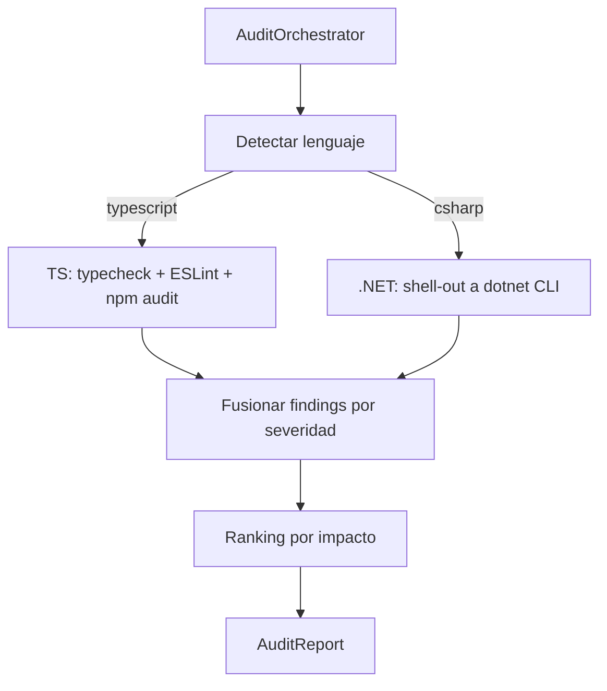

# 11 · Code Analyzer — Codexa

> **Estado:** Borrador v0.1 · **Última actualización:** 2026-08-05
> **Documentos relacionados:** [03-System-Architecture](03-System-Architecture.md) · [08-Backend-Architecture](08-Backend-Architecture.md) · [10-AI-Engine](10-AI-Engine.md) · [20-Repository-Safety] · [19-Security]

---

## 1. Visión general

`@codexa/analysis` es el paquete de análisis de código de Codexa. Ejecuta **chequeos
deterministas y locales** sobre el repositorio y produce un `AuditReport` estructurado que la IA
usa como entrada.

**Doble soporte de lenguajes:**

| Target            | Motor                                        | Requisito del host |
| ----------------- | -------------------------------------------- | ------------------ |
| **TypeScript/JS** | Análisis nativo TS (compiler API + `ts-morph`, ESLint, `npm audit`) | Node.js 20         |
| **.NET (C#)**     | Shell-out al CLI `dotnet` (`dotnet build`, `dotnet test`, `dotnet list package`) | .NET SDK instalado |

El CLI .NET se invoca como subproceso desde TypeScript; si no hay SDK, el análisis .NET se
marca como `skipped` y el resto continúa.

---

## 2. Roles y responsabilidades

| Responsabilidad                       | Dónde vive                    | Tecnología                      |
| ------------------------------------- | ----------------------------- | ------------------------------- |
| Analizar código de forma determinista | `packages/analysis/src`       | TypeScript, `ts-morph`          |
| Detectar errores de compilación       | `TypeChecker` (TS)            | TypeScript compiler API         |
| Lint y reglas de estilo               | `EslintAnalyzer`              | ESLint con config estándar      |
| Vulnerabilidades de dependencias      | `DependencyScanner`           | `npm audit` / `.NET` NuGet      |
| Métricas de complejidad               | `ComplexityAnalyzer`          | `eslint` + `ts-morph`           |
| Proyectos .NET                        | `DotnetBridge`                | Shell-out a `dotnet` CLI        |
| Orquestar análisis                    | `AuditOrchestrator`           | Recorre pasos en orden          |

---

## 3. Entrada y salida

```typescript
// contracts/analysis.ts (extracto)
export interface AnalyzerContext {
  rootDir: string;
  language: 'typescript' | 'csharp';
  buildCommand?: string;
  testCommand?: string;
}

export interface AuditReport {
  auditId: string;
  status: 'success' | 'degraded';
  checks: AnalyzerCheck[];
  repoSummary: RepoSummary;
}

export interface AnalyzerCheck {
  id: string;
  name: string;
  status: 'passed' | 'warnings' | 'failed' | 'skipped';
  findings: Finding[];
}
```

---

## 4. Pipeline de análisis



### 4.1 Orquestador

```typescript
// orchestrator.ts
export class AuditOrchestrator {
  constructor(
    private readonly analyzers: Analyzer[],
    private readonly dotnet: DotnetBridge,
  ) {}

  async run(ctx: AnalyzerContext): Promise<AuditReport> {
    const checks: AnalyzerCheck[] = [];
    for (const analyzer of analyzersFor(ctx.language)) {
      checks.push(await analyzer.run(ctx));
    }
    const repoSummary = await summarizeRepo(ctx);
    return { auditId: randomUUID(), status: 'success', checks, repoSummary };
  }
}
```

---

## 5. Análisis de TypeScript (nativo)

### 5.1 Compilación y tipos

```typescript
// analyzers/typescript/typecheck.analyzer.ts
import ts from 'typescript';
import { Project } from 'ts-morph';

export async function typecheck(ctx: AnalyzerContext): Promise<AnalyzerCheck> {
  const project = new Project({ tsConfigFilePath: join(ctx.rootDir, 'tsconfig.json') });
  const diagnostics = project.getPreEmitDiagnostics();
  return {
    id: 'typecheck',
    name: 'Typecheck',
    status: diagnostics.length === 0 ? 'passed' : 'failed',
    findings: diagnostics.map(toFinding),
  };
}
```

### 5.2 Vulnerabilidades de dependencias

```typescript
// analyzers/typescript/dependency.analyzer.ts
export async function scanNpmDependencies(ctx: AnalyzerContext) {
  const { stdout } = await execAsync('npm audit --json', { cwd: ctx.rootDir });
  const report = JSON.parse(stdout) as NpmAuditReport;
  return {
    id: 'dependencies',
    name: 'Dependencias vulnerables',
    status: report.metadata.vulnerabilities.critical > 0 ? 'failed' : 'passed',
    findings: flattenVulns(report.vulnerabilities),
  };
}
```

---

## 6. Análisis de .NET (shell-out)

`DotnetBridge` ejecuta el CLI `dotnet` como subproceso y traduce la salida a findings:

```typescript
// dotnet/dotnet.bridge.ts
import { execFile } from 'node:child_process';

export class DotnetBridge {
  constructor(private readonly sdkPath = 'dotnet') {}

  async run(args: string[], cwd: string): Promise<{ code: number; stdout: string }> {
    return new Promise((resolve, reject) => {
      execFile(this.sdkPath, args, { cwd, timeout: 5 * 60_000 },
        (err, stdout, stderr) => err ? reject(err) : resolve({ code: 0, stdout }));
    });
  }

  async available(): Promise<boolean> {
    try { await this.run(['--version'], process.cwd()); return true; }
    catch { return false; }
  }
}
```

Comandos usados:
- `dotnet build --no-restore` → errores de compilación (`CSxxxx`).
- `dotnet test --no-build` → tests fallidos (fallo de `TestCoverageAnalyzer` si cubierta baja).
- `dotnet list <csproj> package --vulnerable --include-transitive` → CVE por paquete NuGet.

Si `dotnet` no está en el PATH o no hay `.csproj`/`.sln`, el/los checks .NET se reportan como
`skipped` (el reporte sigue siendo válido con status `degraded`).

---

## 7. Ranking de severidad

| Severidad | Criterio (ejemplos)                                   |
| --------- | ----------------------------------------------------- |
| Critical  | CVE con exploit público, error de build, secreto.     |
| High      | CVE sin fix, código inalcanzable en rutas críticas.   |
| Medium    | Complejidad ciclomática > umbral, test faltante.      |
| Low       | Dead code aislado, estilo.                            |

---

## 8. Rendimiento y seguridad

- Ejecutar `tsc`/`npm audit`/`dotnet` con `timeout` y límite de memoria; nunca en el hilo del
  event loop (worker BullMQ — ver [08-Backend-Architecture](08-Backend-Architecture.md) §8).
- El código del repo se **clona a un sandbox** y se borra tras la auditoría
  ([20-Repository-Safety]).
- No se envían secretos al prompt de IA: sanitización previa (ver [10-AI-Engine](10-AI-Engine.md) §7).

---

## 9. Testing

- Golden tests para cada analyzer con fixtures de repos pequeños.
- `DotnetBridge` se mockea en CI (sin SDK).
- Muestras reales de `npm audit --json` para el mapeo CVE→finding.
- Detalle: [16-Testing-Strategy].

---

## 10. Checklist de implementación

- [ ] `ts-morph` typecheck con `getPreEmitDiagnostics`.
- [ ] `EslintAnalyzer` con config estándar y severidades.
- [ ] `DependencyScanner` parseando `npm audit --json`.
- [ ] `DotnetBridge` con `available()` y timeout.
- [ ] Mapeo `CSxxxx` y CVEs a `Finding`.
- [ ] `AuditOrchestrator` con orden y manejo de `skipped`.

---

## 11. Historial del documento

| Versión | Fecha      | Cambios                              |
| ------- | ---------- | ------------------------------------ |
| v0.1    | 2026-08-05 | Primera versión completa (Entrega 2). |
| v0.2    | 2026-08-05 | Migración a TypeScript + shell-out a `dotnet` CLI. |

---

[16-Testing-Strategy]: 16-Testing-Strategy.md
[20-Repository-Safety]: 20-Repository-Safety.md
[19-Security]: 19-Security.md
