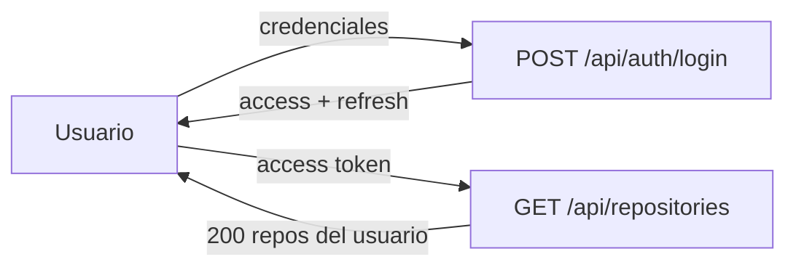
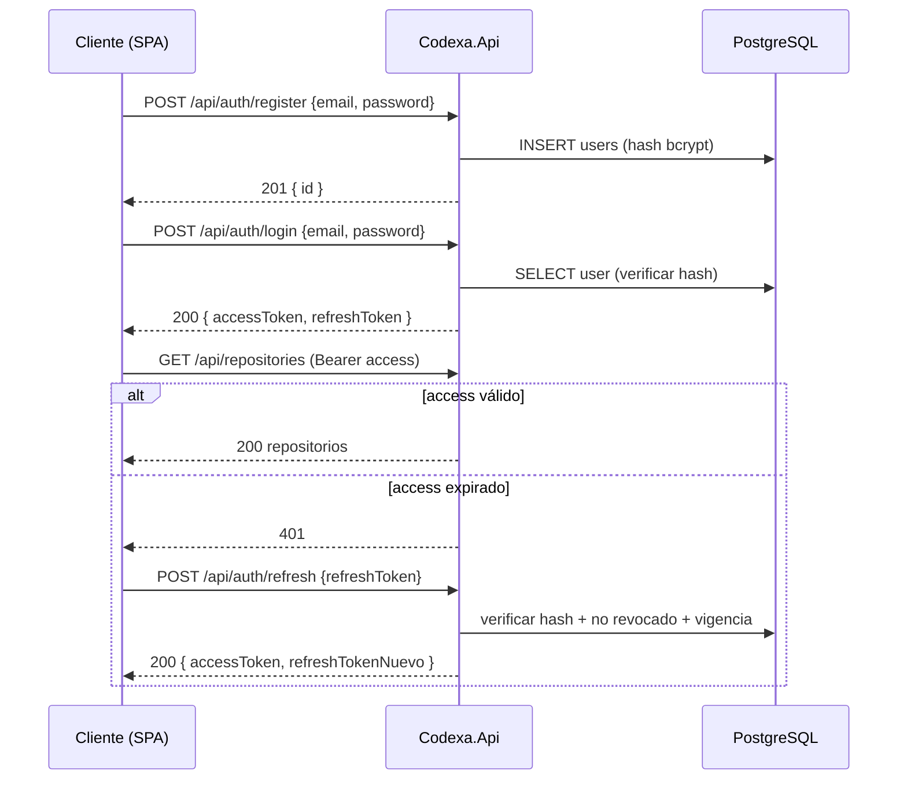

# 12 · Authentication and Authorization — Codexa

> **Estado:** Borrador v0.1 · **Última actualización:** 2026-08-05
> **Documentos relacionados:** [07-Database-Design](07-Database-Design.md) · [08-Backend-Architecture](08-Backend-Architecture.md) · [14-API-Documentation](14-API-Documentation.md) · [19-Security] · [22-Contributing]

---

## 1. Visión general

Codexa usa **JWT** con dos tokens: **access** (corto) y **refresh** (largo y rotativo). El modelo de
autorización es de **propiedad**: cada usuario solo accede a sus propios repositorios y auditorías
(FR-062).



---

## 2. Flujo de tokens



### 2.1 Duración de los tokens

| Token        | Vida útil | Almacenamiento en cliente      | Rotación        |
| ------------ | --------- | ------------------------------ | --------------- |
| Access JWT   | 15 min    | Memoria (Zustand store)        | —               |
| Refresh      | 7 días    | `httpOnly` cookie (F2)         | Sí, rotativo    |

**Regla de rotación:** cada uso de un refresh token invalida el anterior y emite uno nuevo. Si se
detecta reutilización de un refresh ya invalidado → se revoca toda la familia (detección de robo).

---

## 3. Contratos

### 3.1 Registrar

```
POST /api/auth/register
{
  "email": "dev@example.com",
  "password": "S3gura!123",
  "displayName": "Dev"
}

201
{ "id": "3fa85f64-5717-4562-b3fc-2c963f66afa6" }
```

### 3.2 Login

```
POST /api/auth/login
{ "email": "dev@example.com", "password": "S3gura!123" }

200
{
  "accessToken": "eyJhbGciOiJIUzI1NiIs...",
  "expiresIn": 900,
  "refreshToken": "f47ac10b-58cc-4372-a567-0e02b2c3d479",
  "user": { "id": "...", "email": "dev@example.com", "displayName": "Dev" }
}
```

### 3.3 Refresh

```
POST /api/auth/refresh
{ "refreshToken": "f47ac10b-58cc-4372-a567-0e02b2c3d479" }

200
{ "accessToken": "eyJ...", "expiresIn": 900, "refreshToken": "<nuevo>" }
```

---

## 4. Política de contraseñas

| Regla                          | Valor                    |
| ------------------------------ | ------------------------ |
| Longitud mínima                | 12 caracteres            |
| Alfanumérica + símbolo         | Requerido                |
| Hash                           | bcrypt (cost 12) / Argon2id |
| Reutilización                  | 5 contraseñas previas (hash) |
| Bloqueo por intentos fallidos  | 5 intentos → 15 min lockout |

`PasswordHasher` en `Codexa.Infrastructure/Auth` con `Rfc2898DeriveBytes`/bcrypt; nunca guardar
plain text.

---

## 5. JWT — estructura y validación

```json
{
  "sub": "3fa85f64-5717-4562-b3fc-2c963f66afa6",
  "email": "dev@example.com",
  "jti": "0a1b2c...",
  "iat": 1754400000,
  "exp": 1754400900,
  "iss": "https://api.codexa.dev",
  "aud": "codexa-web"
}
```

| Parámetro | Config (`ConfigService`)     | Recomendación                |
| --------- | ---------------------------- | ---------------------------- |
| `issuer`  | `JWT_ISSUER`                 | URL pública de la API.       |
| `audience`| `JWT_AUDIENCE`               | `codexa-web` (SPA).          |
| `secret`  | `JWT_SECRET` (secret store)  | ≥ 32 bytes aleatorios.       |
| Algoritmo | HS256                        | Suficiente para un solo issuer; considerar RS256 si habrá múltiples consumidores. |

Registro en el módulo de auth (NestJS + `@nestjs/jwt`):

```typescript
// auth/auth.module.ts
import { JwtModule } from '@nestjs/jwt';

@Module({
  imports: [
    JwtModule.registerAsync({
      global: true,
      inject: [ConfigService],
      useFactory: (config: ConfigService) => ({
        secret: config.getOrThrow<string>('JWT_SECRET'),
        signOptions: {
          issuer: config.getOrThrow<string>('JWT_ISSUER'),
          audience: config.getOrThrow<string>('JWT_AUDIENCE'),
          expiresIn: '15m',
        },
      }),
    }),
  ],
})
export class AuthModule {}
```

---

## 6. Autorización

### 6.1 Modelo de propiedad

```typescript
// queries/get-audit.query.ts
export class GetAuditQuery {
  constructor(
    public readonly auditId: string,
    public readonly ownerId: string,
  ) {}
}

// queries/get-audit.handler.ts
@QueryHandler(GetAuditQuery)
export class GetAuditHandler implements IQueryHandler<GetAuditQuery> {
  constructor(private readonly audits: AuditService) {}

  async execute(query: GetAuditQuery) {
    const audit = await this.audits.findByIdWithOwner(query.auditId);
    if (!audit) throw new NotFoundException('audit.not_found', 'La auditoría no existe.');
    if (audit.repository.ownerId !== query.ownerId) {
      throw new ForbiddenException('audit.forbidden', 'No tienes acceso.');
    }
    return this.audits.toDto(audit);
  }
}
```

El `ownerId` siempre se inyecta desde el token (`@CurrentUser`), **nunca** desde el cuerpo de la
petición (evita IDOR).

### 6.2 Roles (reservados para el futuro)

| Rol         | Permisos                                      | Disponible |
| ----------- | --------------------------------------------- | ---------- |
| `User`      | CRUD de sus repositorios y auditorías         | Fase 2     |
| `Admin`     | Gestión de usuarios, configuración global     | Fase 4     |

Controlador de ejemplo:

```typescript
// users/users.controller.ts
@Controller('users')
export class UsersController {
  @Roles('admin')
  @UseGuards(JwtAuthGuard, RolesGuard)
  @Delete(':id')
  async deleteUser(@Param('id', ParseUUIDPipe) id: string) { /* ... */ }
}
```

---

## 7. Rate limiting

- **Login/registro:** 10 req/min por IP.
- **Endpoints de auditoría:** límite por usuario (default 20 auditorías/hora, configurable).
- Implementación: guard con Redis (`rate:audit:<userId>`, ventana deslizante en
  [07-Database-Design](07-Database-Design.md) §9).

```typescript
// common/rate-limit/rate-limit.guard.ts
@Injectable()
export class RateLimitGuard implements CanActivate {
  constructor(private readonly redis: RedisService) {}

  async canActivate(ctx: ExecutionContext): Promise<boolean> {
    const req = ctx.switchToHttp().getRequest();
    const key = req.user?.id ?? req.ip;
    const count = await this.redis.incr(`rate:audit:${key}`);
    if (count === 1) await this.redis.expire(`rate:audit:${key}`, 3600);
    if (count > 20) throw new TooManyRequestsException('rate_limited', 'Límite de auditorías superado.');
    return true;
  }
}
```

---

## 8. Protección adicional

| Ataque            | Mitigación                                                          |
| ----------------- | ------------------------------------------------------------------- |
| CSRF              | Access token en memoria (no en cookie) → CSRF no aplica.            |
| XSS               | React escapa por defecto; CSP headers configurados.                 |
| Token stealing    | Refresh rotativo + detección de reutilización de familia.           |
| Brute force       | Lockout tras 5 intentos + rate limiting.                            |
| IDOR              | `@CurrentUser` inyectado desde el token; checks de propiedad en cada query. |
| JWT key leak      | `JWT_SECRET` nunca en código; rotación de clave documentada en [19-Security]. |

---

## 9. Endpoints de auth (resumen)

| Método | Ruta                     | Descripción                       | Auth |
| ------ | ------------------------ | --------------------------------- | ---- |
| POST   | `/api/auth/register`     | Crear cuenta                      | No   |
| POST   | `/api/auth/login`        | Obtener tokens                    | No   |
| POST   | `/api/auth/refresh`      | Rotar refresh + emitir access     | No (valida refresh) |
| POST   | `/api/auth/logout`       | Revocar refresh activo            | Sí   |
| GET    | `/api/auth/me`           | Datos del usuario autenticado     | Sí   |

Detalle de respuestas y errores en [14-API-Documentation](14-API-Documentation.md).

---

## 10. Checklist de implementación

- [ ] `PasswordHasher` (bcrypt, cost 12) + políticas de contraseña.
- [ ] Registro/Login/Refresh/Logout funcionales con rotación y revocación.
- [ ] `@CurrentUser` inyectado desde el token en todos los handlers.
- [ ] Checks de propiedad en repositorios y auditorías (test IDOR).
- [ ] Rate limiting con Redis en auth y auditorías.
- [ ] Detección de reutilización de refresh (revocación de familia).
- [ ] Tests de seguridad: contraseña débil, token expirado, refresh robado.

---

## 11. Historial del documento

| Versión | Fecha      | Cambios                              |
| ------- | ---------- | ------------------------------------ |
| v0.1    | 2026-08-05 | Primera versión completa (Entrega 3) |
| v0.2    | 2026-08-05 | Migración a NestJS (`@nestjs/jwt` + Passport). |

---

[19-Security]: 19-Security.md
[22-Contributing]: 22-Contributing.md
