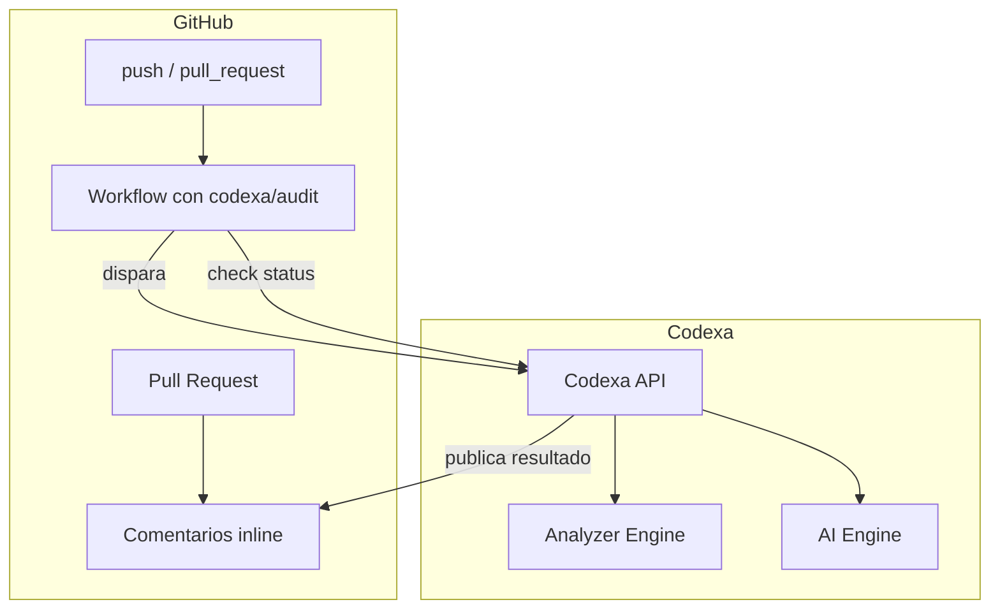
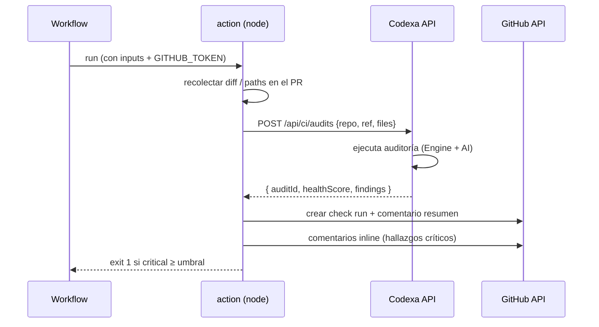

# 13 · GitHub Integration — Codexa

> **Estado:** Borrador v0.1 · **Última actualización:** 2026-08-05
> **Documentos relacionados:** [01-Roadmap](01-Roadmap.md) · [03-System-Architecture](03-System-Architecture.md) · [11-Code-Analyzer](11-Code-Analyzer.md) · [14-API-Documentation](14-API-Documentation.md) · [19-Security]

---

## 1. Objetivo

Automatizar las auditorías dentro del flujo de desarrollo del usuario: auditar en cada push,
comentar los resultados en el PR y bloquear merges cuando se supere un umbral de severidad
(FR-070 a FR-073).



---

## 2. GitHub App (para repositorios conectados)

### 2.1 Permisos mínimos

| Permiso             | Nivel     | Justificación                       |
| ------------------- | --------- | ----------------------------------- |
| `Contents`          | Read      | Leer el código a auditar.           |
| `Pull requests`     | Read/Write| Publicar comentarios y revisar PRs. |
| `Checks`            | Write     | Crear check runs del resultado.     |
| `Metadata`          | Read      | Obligatorio (GitHub lo exige).      |

### 2.2 Configuración de la App

1. Crear la App en GitHub → Settings → Developer settings → GitHub Apps.
2. Webhook `https://api.codexa.dev/api/github/webhook` (secret compartido).
3. Flujo de instalación: el usuario instala la App en sus repositorios.
4. `AppId`, `InstallationId` y la clave privada (`.pem`) se guardan cifrados
   ([19-Security]).

### 2.3 Autenticación de la App (JWT de la App + token de instalación)

```typescript
// github/github-token.service.ts
import { Octokit } from '@octokit/core';
import { createAppAuth } from '@octokit/auth-app';

@Injectable()
export class GitHubTokenService {
  constructor(private readonly config: ConfigService) {}

  // 1. JWT firmado con la clave privada (App)
  // 2. POST /app/installations/{id}/access_tokens → installation token
  async getInstallationToken(installationId: number): Promise<string> {
    const app = new Octokit({
      authStrategy: createAppAuth,
      auth: {
        appId: this.config.getOrThrow('GITHUB_APP_ID'),
        privateKey: this.config.getOrThrow('GITHUB_PRIVATE_KEY'),
        installationId,
      },
    });
    const { data } = await app.request('POST /app/installations/{id}/access_tokens', {
      id: installationId,
      headers: { 'X-GitHub-Api-Version': '2022-11-28' },
    });
    return data.token;
  }
}
```

---

## 3. GitHub Action `codexa/audit`

El Action es el punto de entrada en CI. Código mínimo de `action.yml`:

```yaml
name: "Codexa Audit"
description: "Audita el repositorio y publica el reporte en el PR."
inputs:
  api-url:
    description: "URL de la API de Codexa"
    required: true
  api-key:
    description: "API key del workflow"
    required: true
  llm-provider:
    description: "openai | anthropic | gemini"
    required: false
    default: "openai"
  fail-on-critical:
    description: "Fallar si hay críticos ≥ umbral (default 0 = siempre fallar con críticos)"
    required: false
    default: "0"
outputs:
  health-score:
    description: "Health Score del reporte"
  report-url:
    description: "URL del reporte en Codexa"
runs:
  using: "node20"
  main: "dist/index.js"
```

### 3.1 Workflow de ejemplo

```yaml
name: codexa-audit

on:
  push:
    branches: [main]
  pull_request:

permissions:
  contents: read
  pull-requests: write
  checks: write

jobs:
  audit:
    runs-on: ubuntu-latest
    steps:
      - uses: actions/checkout@v4
      - uses: codexa/audit@v1
        with:
          api-url: ${{ secrets.CODEXA_API_URL }}
          api-key: ${{ secrets.CODEXA_API_KEY }}
          fail-on-critical: 2
        env:
          CODEXA_LLM_API_KEY: ${{ secrets.OPENAI_API_KEY }}
```

### 3.2 Flujo interno del Action



---

## 4. Comentarios en Pull Requests

### 4.1 Resumen (un solo comentario top)

```
## Codexa · Auditoría del PR #42

| Health Score | Críticos | Medios | Bajos | Deuda estimada |
| :----------: | :------: | :----: | :----: | :------------: |
| **87**       | 2        | 13     | 9      | ~8 horas       |

### Sugerencias destacadas
- Divide `UserService` (`src/modules/users/user.service.ts:210`)
- Extrae `PaymentLogic` (`src/modules/payments/payment.service.ts:77`)
- Elimina código duplicado (3 sitios en `src/common/`)

[Ver reporte completo](https://app.codexa.dev/audits/abc123)
```

### 4.2 Inline (por hallazgo crítico)

El Action usa `POST /repos/{owner}/{repo}/pulls/{pr}/reviews` con `comments[]`:

```json
{
  "commit_id": "a1b2c3...",
  "event": "COMMENT",
  "comments": [
    {
      "path": "src/modules/users/user.service.ts",
      "line": 210,
      "side": "RIGHT",
      "body": "**Codexa:** Complejidad ciclomática 24 (umbral 10). Considera extraer `ValidateAndMapUser`."
    }
  ]
}
```

**Regla:** solo se comentan hallazgos en líneas que pertenecen al diff del PR (evita ruido en
código no tocado).

---

## 5. Webhooks (opcional, Fase 3+)

| Evento           | Acción                                 |
| ---------------- | -------------------------------------- |
| `push`           | Auditar la rama actual (async).        |
| `pull_request`   | Auditar y publicar comentarios.        |
| `installation`   | Alta/baja de repositorios conectados.  |

El webhook valida la firma `X-Hub-Signature-256` (HMAC con el secret compartido) antes de procesar.

---

## 6. Mapeo de repositorios conectados

| Entidad de GitHub        | Entidad de Codexa                     |
| ------------------------ | ------------------------------------- |
| App installation         | `GitHubInstallation`                  |
| Repositorio instalado    | `Repositories` (`provider=github`)    |
| PR / push                | `Audits` (`trigger=github_action`)    |

El dashboard permite "Conectar repositorio" vía OAuth de la App; el repositorio queda vinculado al
usuario que lo conecta.

---

## 7. Seguridad

| Riesgo                          | Mitigación                                                  |
| ------------------------------- | ----------------------------------------------------------- |
| Token de instalación filtrado   | TTL corto (GitHub los expira en 1 h); regenerar por auditoría. |
| Webhook falsificado             | Verificación de firma `X-Hub-Signature-256`.                |
| Action abusa del rate limit     | Rate limiting por repositorio en la API.                    |
| Clave privada de la App         | Guardada cifrada; nunca en el repo.                         |
| Comentarios con información sensible | Truncar mensajes > 200 caracteres; no incluir secretos. |

---

## 8. Checklist de implementación

- [ ] Registro de GitHub App + guardado cifrado de credenciales. *(slice 2, no empezado)*
- [ ] `GitHubTokenService` (JWT App + installation token) con tests mock. *(slice 2, no empezado)*
- [x] Action `codexa/audit` con node runtime y tests locales — `apps/github-action`, sin dependencia
      de la GitHub App: autentica contra la API de Codexa con una API key por repositorio
      (`X-Codexa-Api-Key`, ver [14-API-Documentation] §3.4 y §5) y usa el `GITHUB_TOKEN` del propio
      workflow (input `github-token`, default `${{ github.token }}`) para comentar el PR.
- [x] Crear check run y comentario resumen en PR.
- [x] Comentarios inline solo en líneas del diff (solo hallazgos `critical`; diff parseado del
      `patch` de `GET /pulls/{pr}/files`, sin dependencias externas).
- [x] `fail-on-critical` con umbral configurable (`apps/github-action/src/threshold.ts`).
- [ ] Webhook con verificación de firma (Fase 3+, slice 2).
- [ ] Conectar repositorio desde el dashboard (Fase 3, slice 2 — hoy la API key de CI se genera
      manualmente vía `POST /repositories/{id}/ci-key`, sin UI todavía).

> **Nota:** el output `report-url` del `action.yml` original de este documento se quitó — no existe
> todavía una vista de reporte pública/compartible para auditorías disparadas por CI.

---

## 9. Historial del documento

| Versión | Fecha      | Cambios                              |
| ------- | ---------- | ------------------------------------ |
| v0.1    | 2026-08-05 | Primera versión completa (Entrega 3) |
| v0.2    | 2026-08-20 | §8 actualizado: slice 1 (Action `codexa/audit`, §3-4) implementado sin depender de la GitHub App (§2, slice 2 pendiente). |

---

[19-Security]: 19-Security.md
[14-API-Documentation]: 14-API-Documentation.md
