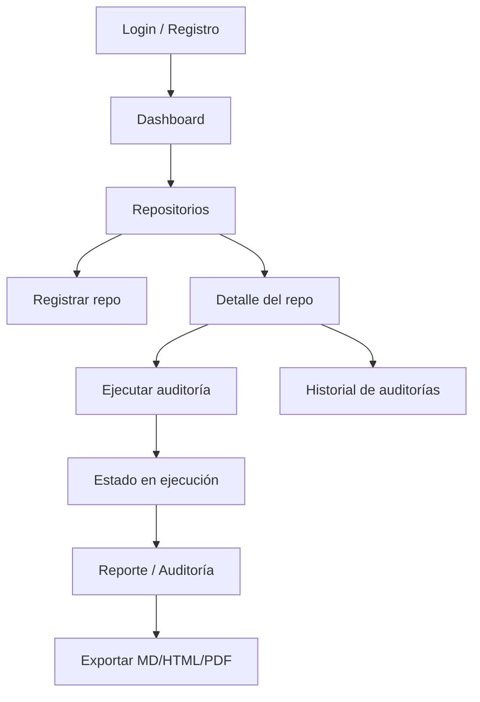
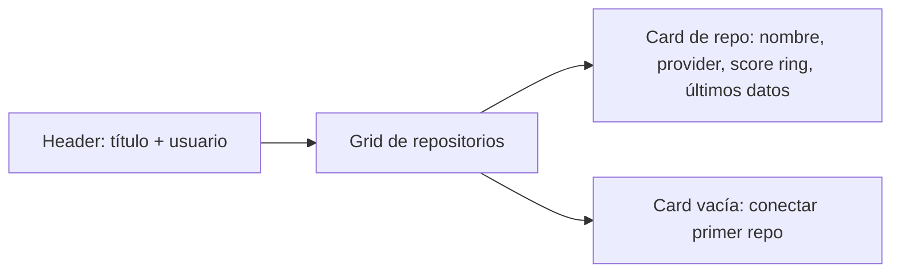

# 15 · UI/UX Design — Codexa

> **Estado:** Borrador v0.1 · **Última actualización:** 2026-08-05
> **Documentos relacionados:** [09-Frontend-Architecture](09-Frontend-Architecture.md) · [10-AI-Engine](10-AI-Engine.md) · [05-Coding-Standards](05-Coding-Standards.md) · [14-API-Documentation](14-API-Documentation.md)

---

## 1. Principios de diseño

1. **El reporte es el héroe.** El dashboard existe para mostrar el reporte de forma clara; todo lo
   demás (formularios, listas) es secundario.
2. **Densidad sin ruido.** Mucha información en pantalla, ordenada por jerarquía: score → resumen →
   hallazgos → sugerencias.
3. **Color con significado.** Severidad = color (crítico/medio/bajo). Nunca color por estética
   que contradiga el significado.
4. **Estados honestos.** Carga, vacío, error y "IA no disponible" tienen UI explícita.
5. **Accesible por defecto.** Contraste, navegación por teclado, roles ARIA (WCAG 2.1 AA).

---

## 2. Arquitectura visual (flujo del usuario)



---

## 3. Pantallas

### 3.1 Login / Registro

- Campos: email, contraseña (login); + nombre de usuario (registro).
- Validación en vivo; mensajes de error bajo cada campo.
- Enlace de alternancia login ⇄ registro.
- Factoría: enlace "Probar con cuenta demo" (solo Development).

### 3.2 Dashboard



- **Hero:** último repositorio auditado con `HealthScoreRing`.
- **Grid:** cards de repositorios con score, fecha de última auditoría y severidades.
- **Carga:** skeleton cards (no spinner genérico).
- **Vacío:** ilustración + CTA "Registrar tu primer repositorio".

### 3.3 Detalle del repositorio

- Cabecera con nombre, URL, provider.
- **Tendencias:** mini-gráfico del historial de scores (Fase 4).
- Lista de auditorías (fecha, score, status, duración) → navega al reporte.
- Botón **"Auditar ahora"** (con estado de carga).

### 3.4 Reporte de auditoría (pantalla principal)

Layout en secciones apiladas (una columna, scroll natural):

| Sección            | Contenido                                                        |
| ------------------ | ---------------------------------------------------------------- |
| **Header**         | `HealthScoreRing`, metadata (fecha, commit, proveedor, duración). |
| **Resumen ejecutivo** | Párrafo IA + tarjetas de métricas (críticos, medios, deuda).   |
| **Hallazgos**      | Tabla/cards filtrables por severidad, agrupables por archivo.     |
| **Sugerencias**    | Cards con `title`, `description`, `targetFile:line` y badge de tipo. |
| **Exportar**       | Botones Markdown / HTML / PDF.                                   |

### 3.5 Ejecución de auditoría

- Pantalla "en ejecución": animación de pasos (Recolectando → Analizando → Generando sugerencias)
  con estado en vivo (polling de `GET /api/audits/{id}`).
- Al terminar: transición suave al reporte.

---

## 4. Componentes clave

### 4.1 HealthScoreRing

- Anillo SVG (0-100) con color por rango:

| Rango  | Color     | Label      |
| ------ | --------- | ---------- |
| 80-100 | `emerald` | Saludable  |
| 50-79  | `amber`   | En riesgo  |
| 0-49   | `red`     | Crítico    |

```tsx
export function HealthScoreRing({ score }: { score: number }) {
  const color = score >= 80 ? "#10b981" : score >= 50 ? "#f59e0b" : "#ef4444";
  const r = 45, c = 2 * Math.PI * r;
  const offset = c - (score / 100) * c;
  return (
    <svg viewBox="0 0 100 100" role="img" aria-label={`Health Score ${score} de 100`}>
      <circle cx="50" cy="50" r={r} stroke="#e2e8f0" strokeWidth="10" fill="none" />
      <circle cx="50" cy="50" r={r} stroke={color} strokeWidth="10" fill="none"
        strokeDasharray={c} strokeDashoffset={offset} strokeLinecap="round"
        transform="rotate(-90 50 50)" />
      <text x="50" y="50" textAnchor="middle" dy="0.35em" fontSize="28" fontWeight="bold">{score}</text>
    </svg>
  );
}
```

### 4.2 SeverityBadge

| Severidad | Clases Tailwind                     |
| --------- | ----------------------------------- |
| Critical  | `bg-red-100 text-red-700`           |
| Medium    | `bg-amber-100 text-amber-700`       |
| Low       | `bg-slate-100 text-slate-600`       |

### 4.3 MetricCard

Tarjeta con título, valor grande y delta (ej. "Deuda estimada · 8 h").

### 4.4 FindingRow

Fila de hallazgo: badge severidad + `ruleId` + mensaje + `filePath:line`. Click → código en
nuevo tab (link al archivo si está disponible).

### 4.5 SuggestionCard

Card de sugerencia IA: badge de tipo, título, descripción, `targetFile:line`, nota de
"No verificada por compilación" (RB-03).

---

## 5. Estados de UI

| Estado             | Comportamiento                                                        |
| ------------------ | --------------------------------------------------------------------- |
| Loading            | Skeleton de la misma forma que el contenido real.                     |
| Empty              | Mensaje + CTA (nunca una tabla vacía sin contexto).                   |
| Error              | Banner con mensaje + botón "Reintentar".                              |
| IA no disponible   | Banner ámbar en el reporte; sección de sugerencias oculta.            |
| 401 / sesión       | Redirección a login con mensaje de sesión expirada.                   |

---

## 6. Accesibilidad (WCAG 2.1 AA)

- Contraste ≥ 4.5:1 para texto normal (los colores por severidad cumplen en `-100`/`-700`).
- Navegación por teclado: foco visible en todos los controles (`focus-visible`).
- `aria-label` en iconos y anillos de score; tablas con `th scope`.
- Texto alternativo en la exportación a imagen.

---

## 7. Tokens de diseño

```ts
// tailwind.config.ts (resumen)
export default {
  theme: {
    extend: {
      colors: {
        brand: { 50: "#eef2ff", 500: "#6366f1", 700: "#4338ca" },
        severity: {
          critical: "#dc2626",  // red-600
          medium: "#d97706",    // amber-600
          low: "#64748b",       // slate-500
        },
      },
      borderRadius: { card: "0.75rem" },
      fontFamily: { sans: ["Inter", "system-ui", "sans-serif"] },
    },
  },
};
```

> Los tokens finales deben sincronizarse con el archivo de diseño (`.pen`) vía
> `get_variables`/`set_variables` del editor de diseño, y con los estilos de este dashboard.

---

## 8. Flujo de error y vacíos de datos (reglas de negocio de UI)

| Situación                              | UI                                                            |
| -------------------------------------- | ------------------------------------------------------------- |
| Repositorio sin auditorías             | Estado vacío + CTA "Auditar ahora".                            |
| Auditoría sin sugerencias (IA falló)   | Sección de sugerencias oculta + banner "IA no disponible".     |
| Hallazgos críticos > 0                 | Badge "X críticos" destacado en rojo en el header del reporte. |
| Historial con una sola auditoría       | Tendencias muestran "se necesita más de una auditoría".        |

---

## 9. Checklist de implementación

- [ ] Design tokens (colores de severidad, radios, tipografía) definidos.
- [ ] `HealthScoreRing` con rangos de color + ARIA.
- [ ] Pantallas: login, dashboard, detalle repo, reporte, ejecución.
- [ ] Estados loading (skeletons), empty y error en cada pantalla.
- [ ] Filtro de hallazgos por severidad + agrupación por archivo.
- [ ] Exportación (MD/HTML/PDF) desde el reporte.
- [ ] Audit de accesibilidad básica (contraste, teclado, roles).
- [ ] Capturas listas para portafolio (reporte de un repo real).

---

## 10. Historial del documento

| Versión | Fecha      | Cambios                              |
| ------- | ---------- | ------------------------------------ |
| v0.1    | 2026-08-05 | Primera versión completa (Entrega 3) |

---
