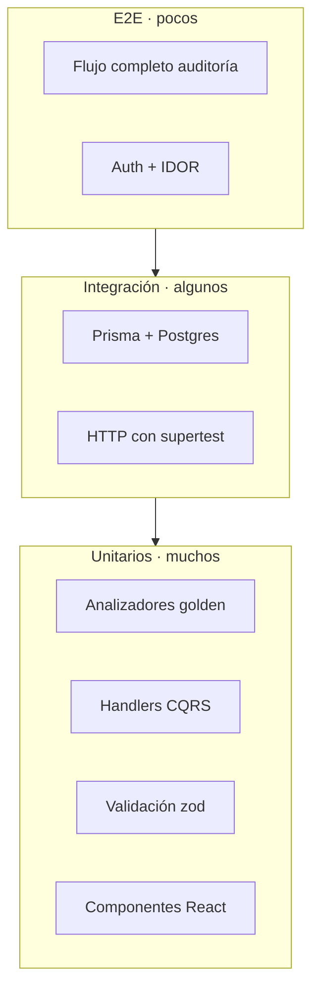

# 16 · Testing Strategy — Codexa

> **Estado:** Borrador v0.1 · **Última actualización:** 2026-08-05
> **Documentos relacionados:** [05-Coding-Standards](05-Coding-Standards.md) · [08-Backend-Architecture](08-Backend-Architecture.md) · [10-AI-Engine](10-AI-Engine.md) · [11-Code-Analyzer](11-Code-Analyzer.md) · [22-Contributing](22-Contributing.md)

---

## 1. Visión general

Codexa es una herramienta cuya salida (auditorías) debe ser **confiable y repetible**. La
estrategia de testing prioriza:

1. **Determinismo:** los analizadores se prueban con fixtures de repos pequeños y fijos.
2. **Sin red:** la IA y GitHub se mockean; los tests nunca llaman a la API real en CI.
3. **Pirámide invertida:** muchos tests unitarios, algunos de integración, pocos e2e.

Stack: **Jest** + `ts-jest`, **supertest** (e2e HTTP), `@nestjs/testing` (módulos), Prisma contra
Postgres real en integración.

---

## 2. Pirámide de tests



---

## 3. Tipos de tests

| Tipo        | Herramienta            | Cobertura objetivo                        |
| ----------- | ---------------------- | ----------------------------------------- |
| Unit        | Jest                   | Analizadores, handlers, servicios, UI.    |
| Integración | `@nestjs/testing` + supertest + Postgres | Flujos de datos reales. |
| E2E         | supertest + Prisma     | Ruta crítica (auditoría → reporte).       |

---

## 4. Unit tests — analizadores (golden)

Los analizadores de `@codexa/analysis` se prueban con **fixtures** en `fixtures/`:

```bash
fixtures/
  typescript-basic/     # repo TS con dead code conocido
  typescript-vulnerable/  # package.json con CVEs de ejemplo
  dotnet-basic/         # repo .NET mínimo (solo DotnetCliAnalyzer)
  snapshots/            # golden outputs esperados
```

```typescript
// packages/analysis/src/__tests__/typecheck.test.ts
describe('typecheck analyzer', () => {
  it('given valid tsconfig when run then returns passed', async () => {
    const ctx: AnalyzerContext = {
      rootDir: fixtures('typescript-basic'),
      language: 'typescript',
    };
    const check = await typecheck(ctx);
    expect(check.status).toBe('passed');
  });

  it('given dead code fixture when run then reports CD-001', async () => {
    const ctx: AnalyzerContext = { rootDir: fixtures('typescript-basic'), language: 'typescript' };
    const check = await deadCode(ctx);
    expect(check.findings.some((f) => f.ruleId === 'CD-001')).toBe(true);
  });
});
```

Reglas:
- Nunca mutar los fixtures; crear uno nuevo por caso.
- `DotnetBridge` se mockea (no requiere SDK en CI).

---

## 5. Unit tests — backend

### 5.1 Handlers CQRS con `@nestjs/testing`

```typescript
// apps/api/src/modules/audits/__tests__/run-audit.handler.spec.ts
describe('RunAuditHandler', () => {
  let handler: RunAuditHandler;

  beforeEach(async () => {
    const moduleRef = await Test.createTestingModule({
      providers: [
        RunAuditHandler,
        { provide: AuditService, useValue: { run: jest.fn() } },
      ],
    }).compile();

    handler = moduleRef.get(RunAuditHandler);
  });

  it('given repository id when execute then delegates to service', async () => {
    await handler.execute(new RunAuditCommand('repo-1'));
    expect(service.run).toHaveBeenCalledWith('repo-1', undefined, undefined);
  });
});
```

### 5.2 Naming Given_When_Then

- `given <contexto> when <acción> then <resultado esperado>` (ver
  [05-Coding-Standards](05-Coding-Standards.md) §8).

---

## 6. Integration tests — Prisma + Postgres

- En CI se usa Postgres en el workflow (o Testcontainers en local).
- Prisma Migrate despliega el esquema antes de correr la suite.

```typescript
// apps/api/test/audits.e2e-spec.ts
beforeAll(async () => {
  const moduleRef = await Test.createTestingModule({ imports: [AppModule] }).compile();
  app = moduleRef.createNestApplication();
  await app.init();
  prisma = app.get(PrismaService);
  await prisma.$executeRawUnsafe('TRUNCATE audit, finding RESTART IDENTITY CASCADE');
});
```

---

## 7. E2E — flujo crítico

Cubren la **ruta completa**: registrar repo → ejecutar auditoría (con análisis y LLM mockeados) →
leer reporte → exportar.

| Escenario                    | Assert clave                                |
| ---------------------------- | ------------------------------------------- |
| Auditoría completa síncrona  | `200` con `status: queued` + job encolado.  |
| Usuario ajeno al repo        | `403` (check de propiedad / IDOR).          |
| LLM falla                    | Reporte `degraded` sin sugerencias, no 500. |
| Token expirado / inválido    | `401`.                                      |
| Rate limit superado          | `429`.                                      |

---

## 8. Frontend — React Testing Library

- Componentes con `@testing-library/react` y `jest-dom`.
- Estado global (Zustand) y queries (TanStack Query) se prueban con mocks de hooks.
- Snapshots: solo para componentes estables (Badge, StatusPill).

---

## 9. Cobertura y métricas

| Métrica          | Objetivo |
| ---------------- | -------- |
| Cobertura unit   | ≥ 80%    |
| Cobertura packages (analysis/ai) | ≥ 85%    |
| E2E ruta crítica | 100% escenarios tabla §7 |

---

## 10. CI

```yaml
jobs:
  test:
    runs-on: ubuntu-latest
    services:
      postgres:
        image: postgres:16
        env: { POSTGRES_DB: codexa_test, POSTGRES_PASSWORD: test }
        ports: ["5432:5432"]
    steps:
      - uses: actions/checkout@v4
      - uses: actions/setup-node@v4
        with: { node-version: 20, cache: "npm" }
      - run: npm ci
      - run: npx prisma migrate deploy
      - run: npm run lint
      - run: npm run typecheck
      - run: npm test -- --coverage
```

---

## 11. Checklist de implementación

- [ ] Jest configurado en todos los workspaces (`apps/api`, `apps/cli`, `apps/frontend`, packages).
- [ ] Fixtures golden para cada analizador.
- [ ] Suite de integración con Prisma + Postgres.
- [ ] Tests de IDOR y rate limit (seguridad).
- [ ] CI con Postgres service y `migrate deploy`.
- [ ] Mocks de LLM y GitHub en todos los entornos.

---

## 12. Historial del documento

| Versión | Fecha      | Cambios                              |
| ------- | ---------- | ------------------------------------ |
| v0.1    | 2026-08-05 | Primera versión completa (Entrega 4). |
