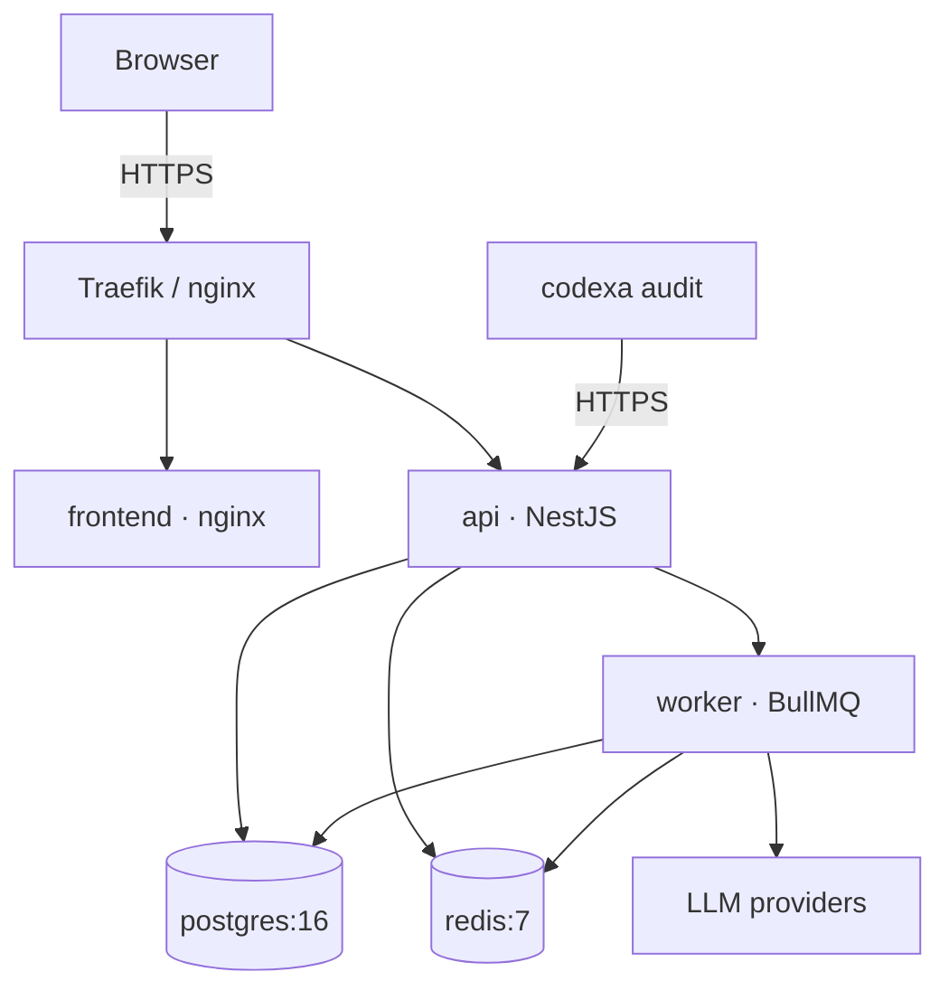

# 17 · Deployment — Codexa

> **Estado:** Borrador v0.1 · **Última actualización:** 2026-08-05
> **Documentos relacionados:** [03-System-Architecture](03-System-Architecture.md) · [08-Backend-Architecture](08-Backend-Architecture.md) · [18-Environment-Variables](18-Environment-Variables.md) · [19-Security](19-Security.md) · [20-Repository-Safety](20-Repository-Safety.md) · [16-Testing-Strategy](16-Testing-Strategy.md)

---

## 1. Visión general

Codexa se despliega como un **monorepo de contenedores** vía Docker Compose en un VPS (fase MVP)
con un pipeline de GitHub Actions. La imagen de producción es de **Node.js 20 + Prisma**; el
análisis de repos .NET es opcional y se activa solo si el host tiene el SDK.

Componentes desplegados:

| Servicio      | Imagen                     | Puertos | Notas                          |
| ------------- | -------------------------- | ------- | ------------------------------ |
| `api`         | `codexa/api` (NestJS)      | 3001    | API + worker BullMQ.           |
| `worker`      | `codexa/api` (mismo build) | —       | Consume colas `audit-queue`.   |
| `cli`         | publicado en npm           | —       | Paquete `@codexa/cli`.         |
| `frontend`    | `codexa/web` (nginx)       | 80/443  | SPA estática servida por nginx.|
| `postgres`    | `postgres:16`              | 5432    | Solo interno (volumen).        |
| `redis`       | `redis:7`                  | 6379    | Cache + rate limit + colas.    |

---

## 2. Topología



---

## 3. Pipeline de CI/CD (GitHub Actions)

```yaml
name: CI/CD
on:
  push:
    branches: [main]
  pull_request:

jobs:
  ci:
    runs-on: ubuntu-latest
    steps:
      - uses: actions/checkout@v4
      - uses: actions/setup-node@v4
        with: { node-version: 20, cache: "npm" }
      - run: npm ci
      - run: npx prisma generate
      - run: npm run lint
      - run: npm run typecheck
      - run: npm test -- --coverage

  deploy:
    if: github.ref == 'refs/heads/main'
    needs: ci
    runs-on: ubuntu-latest
    steps:
      - run: docker build -t codexa/api -f apps/api/Dockerfile .
      - run: docker build -t codexa/web -f apps/frontend/Dockerfile .
      - run: docker push registry.example.com/codexa/api
      - run: docker push registry.example.com/codexa/web
      - name: Deploy via SSH
        uses: appleboy/ssh-action@v1
        with:
          host: ${{ secrets.VPS_HOST }}
          username: ${{ secrets.VPS_USER }}
          key: ${{ secrets.VPS_SSH_KEY }}
          script: |
            cd /opt/codexa && docker compose pull && docker compose up -d --no-deps api worker web
            docker exec codexa-api npx prisma migrate deploy
```

---

## 4. Migraciones en producción

- **Nunca** `migrate dev` en producción; usar `npx prisma migrate deploy`.
- Orden en el deploy: subir contenedores nuevos → `migrate deploy` → restart worker.
- Backup previo recomendado (ver §6).

---

## 5. Dockerfiles

### 5.1 API (multi-stage)

```dockerfile
FROM node:20-alpine AS build
WORKDIR /app
COPY package*.json ./
RUN npm ci
COPY . .
RUN npx prisma generate && npm run build --workspace apps/api

FROM node:20-alpine
WORKDIR /app
ENV NODE_ENV=production
COPY --from=build /app/apps/api/dist ./dist
COPY --from=build /app/node_modules ./node_modules
COPY --from=build /app/node_modules/.prisma ./node_modules/.prisma
EXPOSE 3001
CMD ["node", "dist/main.js"]
```

### 5.2 Frontend (SPA)

```dockerfile
FROM node:20-alpine AS build
WORKDIR /app
COPY package*.json ./
RUN npm ci
COPY . .
RUN npm run build --workspace apps/frontend

FROM nginx:alpine
COPY --from=build /app/apps/frontend/dist /usr/share/nginx/html
COPY nginx.conf /etc/nginx/conf.d/default.conf
```

`nginx.conf` sirve estáticos y hace proxy reverso a `/api` y `/docs`.

---

## 6. Backups

- `pg_dump` diario (cron) + WAL archiving opcional (producción).
- Retención: 14 días local + snapshot mensual a un bucket.
- Restore probado en staging trimestralmente (ver
  [07-Database-Design](07-Database-Design.md) §10).

---

## 7. Observabilidad

| Señal       | Herramienta (MVP)     | Notas                          |
| ----------- | --------------------- | ------------------------------ |
| Logs        | stdout JSON (pino)    | `traceId` por request.         |
| Métricas    | Prometheus + Grafana  | API: p95, error rate, latencia LLM. |
| Alertas     | Uptime + error budget | 99.9% objetivo.                |

---

## 8. Ambientes

| Ambiente    | Uso                    | Base de datos        |
| ----------- | ---------------------- | -------------------- |
| Development | Local (Docker Compose) | Postgres 16 local    |
| Staging     | Pre-producción         | Postgres 16 separado |
| Production  | VPS                      | Postgres 16 + backups |

Cada ambiente con su `.env`; nunca se versionan secretos (ver
[18-Environment-Variables](18-Environment-Variables.md)).

---

## 9. Rollback

- Imágenes versionadas por tag (`vX.Y.Z`); rollback = `docker compose up -d <tag anterior>`.
- La base de datos es **forward-only**: no se revierte una migración; se despliega un fix.
- Estrategia: keep-last-2 releases en el registro.

---

## 10. Checklist de implementación

- [ ] Dockerfiles multi-stage para API, worker y frontend.
- [ ] `docker-compose.prod.yml` con los 6 servicios.
- [ ] Pipeline CI + CD con `migrate deploy` en el paso de deploy.
- [ ] Backups automáticos (pg_dump + cron) y prueba de restore.
- [ ] Traefik/nginx con TLS (Let's Encrypt) y redirección HTTPS.
- [ ] Monitorización básica (uptime + logs centralizados).

---

## 11. Historial del documento

| Versión | Fecha      | Cambios                              |
| ------- | ---------- | ------------------------------------ |
| v0.1    | 2026-08-05 | Primera versión completa (Entrega 4). |
