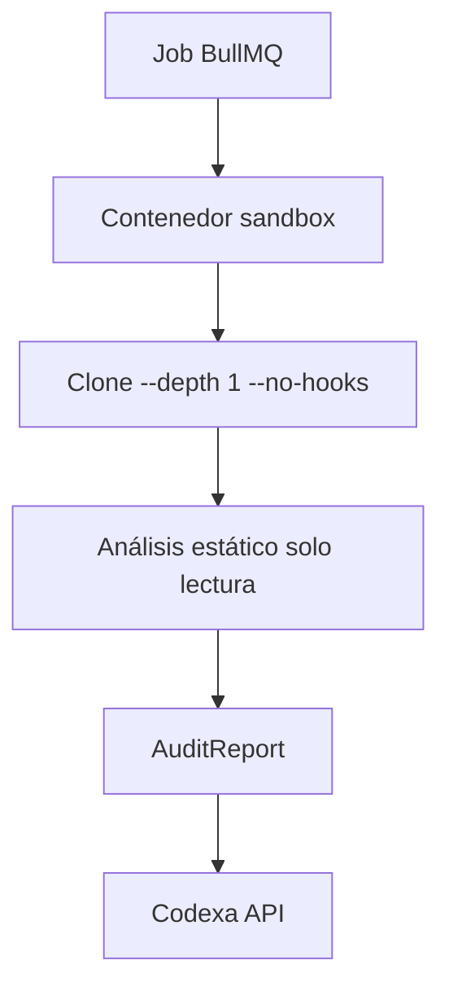

# 20 · Repository Safety — Codexa

> **Estado:** Borrador v0.1 · **Última actualización:** 2026-08-05
> **Documentos relacionados:** [11-Code-Analyzer](11-Code-Analyzer.md) · [17-Deployment](17-Deployment.md) · [19-Security](19-Security.md)

---

## 1. Visión general

Codexa clona y ejecuta análisis sobre **código que no es suyo**. Un repositorio puede ser
malicioso: scripts en hooks, binarios, dependencias con postinstall, símbolos raros, bombas de
directorios. La seguridad del sandbox es **condición de uso** del producto.

Objetivos:
1. Que un repo malicioso **no pueda** escalar privilegios, tocar la red, ni persistir.
2. Que una auditoría **no pueda** agotar recursos del host (DoS).
3. Que **nunca** se envíen secretos del repo a la IA ni a la API.

---

## 2. Modelo de amenazas del repositorio

| Amenaza                          | Ejemplo                              | Mitigación                       |
| -------------------------------- | ------------------------------------ | -------------------------------- |
| Código en hooks de git           | `.git/hooks` con script malicioso    | Clonar sin hooks (`GIT_CONFIG_NOSYSTEM`, `--no-checkout` + sparse). |
| `postinstall` malicioso          | `package.json` con scripts de red    | No ejecutar `npm install`; escanear lockfile estático. |
| Acceso a la red                  | Script que exfiltra datos            | Red del sandbox bloqueada (deny all). |
| Acceso al filesystem del host    | Symlinks hacia fuera del sandbox     | Contenedor aislado, read-only root, cgroups. |
| DoS (fork bombs, memoria)        | Repo enorme / procesos infinitos     | Timeouts, límites de CPU/RAM, tamaño máximo. |
| Exfiltración de secretos         | Repo con `.env` comprometido         | Sanitizador en prompts (ver [10-AI-Engine](10-AI-Engine.md) §7). |

---

## 3. Arquitectura del sandbox



Garantías del contenedor sandbox:

| Propiedad        | Configuración                                        |
| ---------------- | ---------------------------------------------------- |
| Red              | `--network none` (o allowlist solo a la API).        |
| Usuario          | Sin privilegios (`node`/uid no root).                |
| Root filesystem  | Read-only; solo `WORKDIR` escribible.                |
| CPU/Memoria      | Límites cgroup (ej. 1 vCPU, 1 GiB).                  |
| Timeout          | Total por auditoría (ej. 10 min).                    |
| Persistencia     | Ninguna; el contenedor se elimina tras el análisis.  |

---

## 4. Reglas del clonado

```typescript
// sandbox/clone.ts
import { execFile } from 'node:child_process';

export async function cloneToSandbox(repoUrl: string, sandboxDir: string) {
  // Sin hooks, historial mínimo, sin checkout completo innecesario
  await execFile('git', [
    'clone',
    '--depth', '1',
    '--no-single-branch',
    '--config', 'core.hooksPath=/dev/null',
    repoUrl,
    sandboxDir,
  ], { timeout: 5 * 60_000 });
}
```

Reglas adicionales:
- **Nunca** ejecutar `npm install`/`build`/scripts del repo en el MVP (análisis estático).
- Rechazar repos que excedan el tamaño máximo (ej. > 200 MB) o número de archivos (> 50k).
- El `dotnet build` (si el repo es .NET) corre dentro del sandbox con `--no-restore`.

---

## 5. Límites de recursos (NFR-12)

| Recurso        | Límite MVP              | Notas                          |
| -------------- | ----------------------- | ------------------------------ |
| Tamaño repo    | 200 MB / 50k archivos   | Rechazo con error `too_large`. |
| Profundidad clone | depth 1               | Reduce superficie y costo.     |
| Tiempo total   | 10 min                  | Aborto con estado `degraded`.  |
| Memoria        | 1 GiB por análisis      | cgroup.                        |
| CPU            | 1 vCPU                  | cgroup.                        |

---

## 6. Limpieza post-análisis

- El directorio sandbox se **elimina** tras subir el reporte (best-effort + cron de barrido).
- Los reportes solo conservan `filePath`/`lineNumber`/extractos acotados, no el código completo.
- TTL en Redis/colas para jobs huérfanos.

---

## 7. Cli local (auditoría en el dev machine)

- El CLI analiza el directorio **local** del usuario (su propio código); no aplica sandbox.
- Protección: no subir secretos — el CLI sanitiza antes de enviar al pipeline de IA.
- El CLI pide confirmación antes de subir un reporte a la API si detecta `.env`/secretos en el repo.

---

## 8. Testing de la seguridad del sandbox

| Test                      | Assert                                    |
| ------------------------- | ----------------------------------------- |
| Repo con hook malicioso   | Hook no se ejecuta (core.hooksPath=/dev/null). |
| Red bloqueada             | Intento de conexión falla desde el worker. |
| Symlink fuera del sandbox | Lectura denegada.                         |
| Repo gigante              | Rechazo `too_large` sin agotar memoria.   |
| Timeout                   | Job abortado a los 10 min con `degraded`. |

---

## 9. Checklist de implementación

- [ ] Contenedor sandbox con `--network none`, root read-only, usuario no-root.
- [ ] cgroups (CPU/RAM) + timeout global.
- [ ] `clone` sin hooks y `--depth 1` + chequeos de tamaño.
- [ ] Sin ejecución de scripts del repo en el MVP.
- [ ] Sanitizador de secretos en prompts y reportes.
- [ ] Limpieza de sandbox post-análisis + cron de barrido.
- [ ] Suite de tests de seguridad (§8).

---

## 10. Historial del documento

| Versión | Fecha      | Cambios                              |
| ------- | ---------- | ------------------------------------ |
| v0.1    | 2026-08-05 | Primera versión completa (Entrega 4). |
