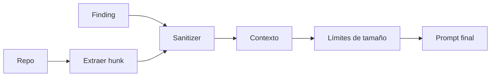

# Context Builder · Codexa AI Engine

> **Rol en el pipeline:** preprocesado. Convierte findings + repositorio en el **contexto de
> entrada** de los prompts. No es un prompt en sí: es el contrato de qué se envía y qué se
> descarta.

---

## 1. Objetivo

Reducir el contexto al **mínimo relevante** y garantizar que **ningún secreto** viaje al
proveedor LLM. Tres reglas de oro:

1. Solo el **hunk/diff** del finding, nunca el archivo completo.
2. Límite de contexto estricto (tabla abajo).
3. Sanitización antes de interpolar en el prompt.

---

## 2. Flujo



---

## 3. Qué se incluye

| Sección          | Contenido                                    | Límite      |
| ---------------- | -------------------------------------------- | ----------- |
| `repoSummary`    | Lenguaje, módulos, líneas, cobertura.        | ~200 tokens |
| `hunks`          | Diff/hunk del finding (con 5 líneas de contexto). | ≤ 4 KB por finding |
| `findings`       | `Finding` sin `metadata` pesada.             | ≤ 10 items  |
| `moduleScores`   | Solo para `audit-summary`.                   | ≤ 20 módulos |

**Nunca se incluye:**

- `.env*`, tokens, API keys, llaves privadas, `credentials.*`.
- Blobs binarios o código minificado.
- Paths absolutos del host o del sandbox.
- El repositorio completo (solo hunks).

---

## 4. Sanitizador

```typescript
// packages/ai/src/sanitize/sanitize.ts
const SECRET_PATTERNS = [
  /(?:api[_-]?key|secret|password|token)\s*[=:]\s*['"][^'"]{8,}['"]/gi,
  /ghp_[A-Za-z0-9]{36}/g,          // GitHub PAT
  /AKIA[0-9A-Z]{16}/g,             // AWS access key
  /sk-[A-Za-z0-9_-]{20,}/g,        // OpenAI/Anthropic keys
  /-----BEGIN [A-Z ]*PRIVATE KEY-----/g,
];

export function sanitize(input: string): string {
  return SECRET_PATTERNS.reduce((acc, re) => acc.replace(re, '[REDACTED]'), input);
}
```

Proceso:
1. Aplicar patrones de secretos sobre el texto del hunk.
2. Comprobar que no quede `[REDACTED]` sobre un `.env` entero (si el hunk ES un `.env`, se
   descarta el archivo completo del contexto).
3. Log del conteo de hallazgos sanitizados (sin contenido).

---

## 5. Límites y coste

| Config               | Default     | Descripción                       |
| -------------------- | ----------- | --------------------------------- |
| `CONTEXT_MAX_HUNKS`  | 10          | Máx. hunks por llamada.           |
| `CONTEXT_HUNK_KB`    | 4           | Máx. KB por hunk.                 |
| `CONTEXT_MAX_TOKENS` | 8 000       | Tope total por llamada.           |

Si el contexto excede el tope, se recortan los findings de menor `likelihood` (nunca los
`critical`).

---

## 5. Verificación con golden tests

- `sanitize` se prueba con fixtures que contienen tokens reales formateados (ver
  [16-Testing-Strategy §4](../../16-Testing-Strategy.md)).
- `buildContext` produce un JSON canónico que se compara con el golden output.
- Assert clave: **el contexto jamás contiene** un patrón de la tabla de secretos.
